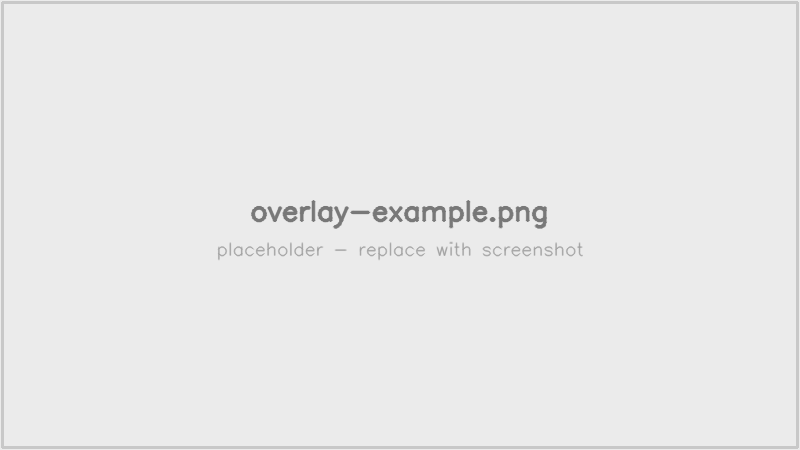
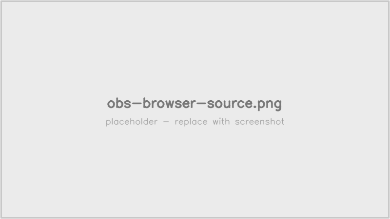
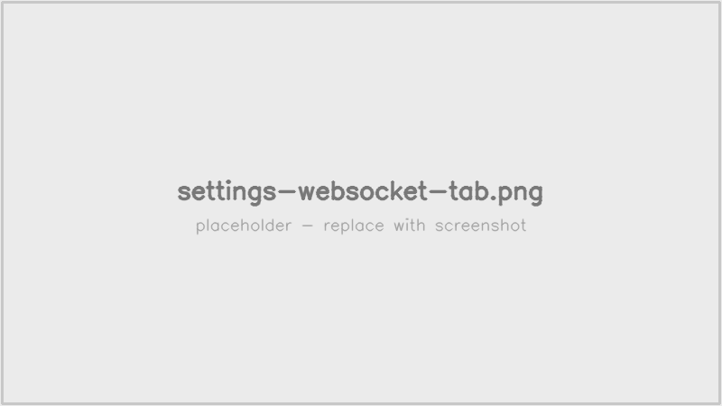

# 配信支援オーバーレイ

[トップ](./) ｜ [インストール](installation.html) ｜ [使い方](usage.html) ｜ **配信支援オーバーレイ**

LivelyRec はゲーム画面に重ねる **HTML オーバーレイ** を提供します。OBS の「ブラウザソース」として読み込むと、打鍵数カウンタや直近リザルトをリアルタイムに表示できます。

## 表示内容

- **打鍵数カウンタ**: 当日のプレイ日累計（COOL / GREAT / GOOD / BAD / TOTAL）
- **楽曲名・難易度**: 現在プレイ中の楽曲
- **直近リザルト**: 最後に記録されたスコア・クリア種別・クリアランク


*OBS のブラウザソースに表示されるオーバーレイの例。*

## セットアップ（同一PCで OBS と LivelyRec を動かす場合）

最も簡単な構成です。LivelyRec の WebSocket 設定はデフォルト（localhost、認証なし）のままで動きます。

### 手順

1. LivelyRec を起動し、メイン画面の「**ブラウザソースURL**」をコピー
   既定値は `http://127.0.0.1:14514/browser/index.html`
2. OBS で **ソース → ブラウザ** を追加
3. URL に上記をペースト
4. 幅・高さは見た目に合わせて調整（例: 幅 320 / 高さ 200）
5. 「カスタム CSS」「ローカルファイル」は不要


*OBS の「ソース → ブラウザ」。URL にブラウザソースURLをペーストします。*

LivelyRec の「記録開始」を押すと、オーバーレイがリアルタイムに更新されます。

## セットアップ（OBS と LivelyRec を別PCで動かす場合 / LAN 公開）

ゲーミングPC で LivelyRec を動かし、配信用PC の OBS にオーバーレイを表示する構成です。

### 手順

1. LivelyRec の「設定」→「**WebSocket**」タブで:
   - **LAN公開**: チェックを入れる
   - 設定を保存


*WebSocket タブ。LAN公開を有効にします。*

2. メイン画面の「ブラウザソースURL」をコピー
   例: `http://192.168.0.10:14514/browser/index.html`
3. **配信用PC** の OBS で **ソース → ブラウザ** を追加し、URL をペースト
4. ファイアウォール: LivelyRec が動くPC の Windows ファイアウォールで、ポート `14514`（TCP）の受信を許可

### セキュリティ

- 本機能は **家庭内 LAN** での利用を想定しています。既定ではトークン認証は無効です。
- より厳密にアクセス制限したい場合は、`livelyrec_data/settings.json` の `websocket_server.token` にランダムな文字列を設定してください。LAN公開時にトークン認証が有効になり、ブラウザソースURLにも `?token=` が自動付与されます。
- 外部公開（インターネット越し）は想定外です。VPN / SSH トンネル等で閉域化してください

## テーマのカスタマイズ

オーバーレイの見た目をカスタムしたい場合、CSS を URL クエリ `?theme=` で差し込めます:

```
http://127.0.0.1:14514/browser/index.html?theme=https://example.com/my-theme.css
```

トークン付きの場合:

```
http://192.168.0.10:14514/browser/index.html?token=xxx&theme=https://example.com/my-theme.css
```

CSS の例は GitHub リポジトリの [`browser_source/style.css`](https://github.com/Freedom645/livelyrec/blob/main/browser_source/style.css){:target="_blank"} を参考にしてください。

## トラブルシュート

| 症状 | 対処 |
|------|------|
| オーバーレイが空白のまま | ブラウザの開発者ツールを開き、Console / Network タブで WS 接続を確認。**0.5 秒ごとに 101 が出続けている**場合は認証失敗 → トークンを設定している場合は URL に `?token=` が付いているか確認 |
| 別PCから接続できない | ファイアウォールで `14514/TCP` の受信が許可されているか、LAN公開がオンになっているか確認 |
| 値が更新されない | LivelyRec が「記録中」になっているか確認。記録停止中はイベントが流れません |
