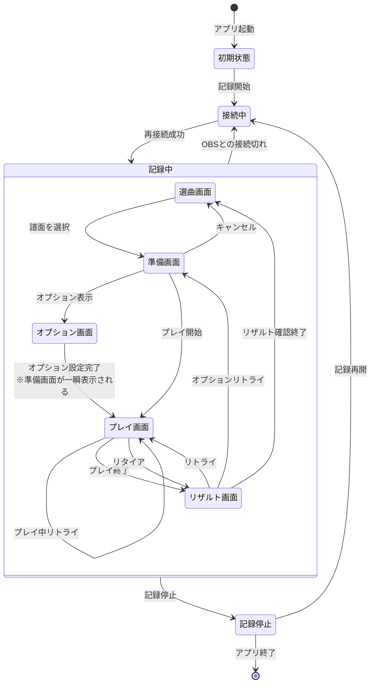

# 要件定義書

## 概要

pop'n music livelyのゲーム画面をソースとして表示するOBSとWebSocket連携してゲーム画面を取得し、画像認識でスコア記録・配信支援するスタンドアロンアプリ。

## 機能

- スコア記録機能（優先度：必須）
  - ゲーム画面判別
    - 選曲画面、準備画面、オプション画面、プレイ画面、リザルト画面であるか画像認識により判別する
  - 選曲中の記録
    - 基本的に記録は行わない
    - 選曲カーソル上の楽曲名と難易度を判別して配信支援機能で過去のリザルトを表示する機能を提供する
  - オプション画面の記録
    - 基本的に記録は行わない
  - プレイ画面の記録
    - 楽曲タイトルを抽出し、アプリ内で持つマスタデータと照合して特定
      - マスタデータは公式サイトで公開されている[収録楽曲一覧](https://p.eagate.573.jp/game/eacpopn/lively/info/music.html)をベースに上級攻略Wikiの[難易度表](https://popn.wiki/%E9%9B%A3%E6%98%93%E5%BA%A6%E8%A1%A8)等と突合して作成を予定。難易度表に全量があるかは不明の為、他のサイトも検討する。
    - リアルタイムに表示される判定数から打鍵回数を算出しカウントアップ（＝打鍵数）
      - 判定数は位置が固定
      - 各判定ごとに色が異なるため、二値化の場合は工夫が必要
        - COOL: 赤紫色
        - GREAT: 黄色
        - GOOD: 赤色
        - BAD: 水色
      - 打鍵数について
        - プレイ当日の24時間で記録
        - e-amuやコナステはAM5:00～AM7:00でメンテナンスするため、AM6:00をプレイ日切替とするのが合理的
        - プレイ日切替でユーザが混乱する可能性があるため、切り替わりタイミングについてはアプリ上で明記する
  - リザルト画面の記録
    - 譜面（楽曲×難易度）に対して下記を記録
      - スコア: 0～100000の整数値
      - 各判定数: COOL, GREAT, GOOD, BAD
      - コンボ数: 0以上の整数値
      - クリア種類: PERFECT, FULL COMBO、CLEAR、FAILED（ASSIST CLEAR、EASY CLEARがあるが画面内では判別不可）
    - 記録データより下記を算出して記録（画面から判別も可能だが難易度が高い）
      - クリアメダル
        - クリア種類及び判定数の組によって決まるメダル
        - 星、ダイヤ、丸の3種類
        - 詳細な仕様は[Wiki](https://w.atwiki.jp/asagaolabo/pages/932.html)を参照
      - クリアランク
        - スコアによって決まるランク
        - S+、S、AAA、AA+、A+、A、B+、B～Eの12種類
        - 詳細な仕様は[Wiki](https://w.atwiki.jp/asagaolabo/pages/4795.html)を参照

- 配信支援機能（優先度：中）
  - OBSブラウザソースで配信支援として下記のデータ表示を行う
    - 打鍵回数グラフ
      - 判定別打鍵数
      - 総打鍵数
    - 過去リザルト表示
      - 選曲画面でカーソル上の譜面の過去リザルト表示
  - データはアプリとのWebSocket通信で取得する想定
- 自動アップデート機能（優先度：中）
  - GitHubのReleaseでバージョンアップを検知した場合にユーザに確認を取ってセルフアップデートする
  - アプリ起動時にGitHub APIでチェックを想定
  - 確認ダイアログ又はアプリ設定にて自動アップデートの要否を設定できるようにする
  - アップデートチェックに失敗した場合は何もせずにアプリ起動する
- CSV書き出し機能（優先度：低）
  - ジャンル名、楽曲名、難易度、スコア
  - デフォルトで出力文字コードはUTF-8、セパレータはカンマとし、出力時にオプションで指定できるようにする
  - 出力できない文字は互換性のある文字に置換を予定
- 外部ツール連携機能（優先度：低）
  - WebSocketインターフェイス公開
    - 任意の方法でWebSocketの仕様を公開（アプリ内又はリポジトリなど）
  - ゲーム画面とリザルトのファイル書き出し
    - WebSocket以外にファイル監視などでデータ取得可能な口を作る
    - 外部ツール等の開発支援を想定した機能

## 状態遷移

状態遷移は下記の通り。アプリを起動して記録する際にゲームプレイ中の場合もあるため、記録中遷移直後の画面状態は不定になる。

## 課題

- マスタデータのアップデート
  - マスタデータを同梱配布するとその都度アップデートが必要になって煩わしくなる
  - ゲームプレイ及び配信にはネットワーク環境が必ず整備されているため、GitHub Pages等で公開してAPI取得できるようにするのが良いと思われる
- 画像認識の難易度
  - 楽曲名
    - 選曲画面及びリザルト画面における楽曲名が文字列ではなくバナー画像で装飾が施されているため、画像認識が難しくなっている
    - プレイ中は画面上部に黒背景と白文字の楽曲名が表示されるため、そちらの認識を優先することで対応が可能と考えられる
    - UPPER譜面と呼ばれる同一楽曲に別譜面が用意されている譜面が存在するため、そちらも識別難易度を上げている
  - クリア種類
    - リザルト画面におけるクリアの種類だが、こちらも画像データの為、少々工夫が必要
    - 色によって
    - 画像としてはパターンが少ない点が楽曲名と比べてマシか
- ユーザ操作によりリザルト画面をスキップされる可能性
  - リザルト画面はボタン連打により完全に表示しきる前にスキップ可能
  - スキップされた場合、プレイしたこと自体の記録は残すが、リザルトは記録不可とする
- プレイ画面からリトライするとプレイ画面に自己遷移する
  - ロード画面が入るが画面認識による状態遷移としては区別がしづらいため少々考慮が必要になる
  - 下記のような不可逆な更新が連続した場合にリトライしたと判別すべきか
    - コンボが0になる
    - 判定数が全て0になる
