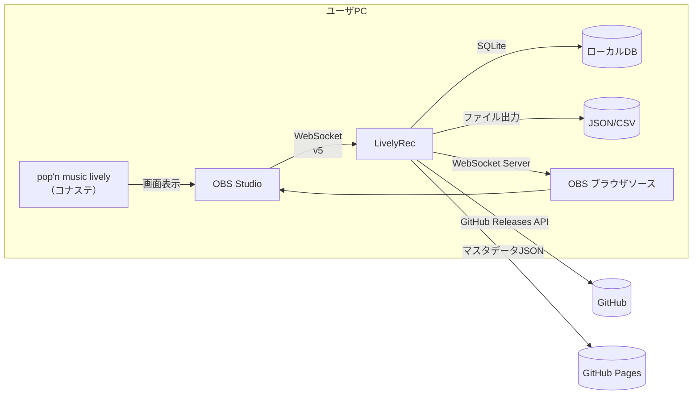

# 要件定義書

| 項目 | 内容 |
|------|------|
| プロダクト名 | LivelyRec |
| 版数 | 0.1（ドラフト） |
| 作成日 | 2026-05-18 |
| 文書ステータス | レビュー前 |
| 前提資料 | `00_要件.md`（オリジナル要件メモ）、`01_プロジェクト計画書.md` |

要件 ID 体系:
- 機能要件: `FR-<カテゴリ>-<連番>`（カテゴリ: REC=スコア記録、STR=配信支援、UPD=アップデート、CSV=CSV出力、EXT=外部連携、SYS=システム共通）
- 非機能要件: `NFR-<カテゴリ>-<連番>`
- 制約: `CON-<連番>`

各要件には **優先度（必須／中／低）** と **受入基準（A-Criteria）** を付与。

---

## 1. ステークホルダ・想定ユーザ

| ステークホルダ | 内容 |
|----------------|------|
| プライマリユーザ | pop'n music lively（コナステ）を配信プレイヤーとして遊ぶ個人。OBS Studio で配信中。 |
| セカンダリユーザ | 配信視聴者（OBS ブラウザソース経由で間接的に恩恵を受ける） |
| 二次利用者（拡張機能経由） | LivelyRec の WebSocket / ファイル出力を利用する外部ツール開発者 |

### 1.1. ユースケース（俯瞰）

| UC ID | ユースケース | 主アクター |
|-------|-------------|-----------|
| UC-01 | 配信を開始し、本アプリの記録を開始する | プライマリユーザ |
| UC-02 | プレイし、リザルトが自動記録されていることを確認する | プライマリユーザ |
| UC-03 | 配信画面に打鍵カウンタ・過去リザルトを表示する | プライマリユーザ／視聴者 |
| UC-04 | プレイ履歴を CSV でエクスポートする | プライマリユーザ |
| UC-05 | アプリのアップデートを適用する | プライマリユーザ |
| UC-06 | 外部ツールから LivelyRec のデータを取得する | 二次利用者 |

---

## 2. システム概要

### 2.1. システム構成（論理）

### 2.2. 外部システム

| 外部システム | 用途 | プロトコル |
|--------------|------|-----------|
| OBS Studio | ゲーム画面のキャプチャ取得 | OBS WebSocket v5（TCP/WebSocket） |
| GitHub Releases | バージョンチェック・更新取得 | HTTPS（GitHub REST API） |
| マスタデータ配布サイト（GitHub Pages 想定） | 楽曲マスタ取得 | HTTPS（静的JSON） |

---

## 3. 機能要件

### 3.1. スコア記録機能（必須）

#### 3.1.1. ゲーム画面判別

| ID | 要件 | 優先度 |
|----|------|--------|
| FR-REC-001 | OBS WebSocket 経由で取得した画面キャプチャから、選曲画面／準備画面／オプション画面／プレイ画面／リザルト画面（およびロード画面）を **画像認識により判別** すること | 必須 |
| FR-REC-002 | 画面遷移は00_要件.mdの状態遷移図に従い、現在状態と矛盾する誤判定はバリデーションで抑制すること | 必須 |
| FR-REC-003 | 判別結果は内部イベントとして発火し、内部モジュールおよび外部WebSocketクライアントへ通知できること | 必須 |

**受入基準（A-Criteria）**:
- `tests/fixtures/sample/` 配下に同梱されたサンプル画像セットすべてで正しい画面種別が判別できること。
- 判別 1 回あたりの処理時間が 100ms 以下（標準PC：CPU 4コア相当）。

#### 3.1.2. 選曲画面の記録

| ID | 要件 | 優先度 |
|----|------|--------|
| FR-REC-010 | 選曲画面では **スコア記録を行わない** こと | 必須 |
| FR-REC-011 | 選曲カーソル上の楽曲名と難易度をマスタデータと照合して特定すること。特定不能時は「未特定」状態で保持 | 必須 |
| FR-REC-012 | カーソル上の譜面情報を内部イベントとして発火し、配信支援機能が過去リザルトを参照できるようにすること | 必須 |

**A-Criteria**: 選曲画面のサンプル画像で、上位N件の楽曲が正しく特定できること（N は基本設計時に確定）。

#### 3.1.3. 準備画面・オプション画面

| ID | 要件 | 優先度 |
|----|------|--------|
| FR-REC-020 | 準備画面・オプション画面ではスコア記録を行わないこと | 必須 |
| FR-REC-021 | 状態遷移管理のため、これらの画面検知は内部状態のみ更新すること | 必須 |

#### 3.1.4. プレイ画面の記録

| ID | 要件 | 優先度 |
|----|------|--------|
| FR-REC-030 | プレイ画面上部に表示される楽曲名（白文字・黒背景）をOCRで抽出し、マスタデータと照合して楽曲を特定すること | 必須 |
| FR-REC-031 | UPPER 譜面が存在する楽曲については、難易度別エントリ（通常／UPPER）を区別して特定すること | 必須 |
| FR-REC-032 | 判定数（COOL／GREAT／GOOD／BAD）の位置を固定座標で抽出し、各判定数を連続取得すること | 必須 |
| FR-REC-033 | 二値化処理では各判定色（COOL=赤紫、GREAT=黄、GOOD=赤、BAD=水色）に対応した前処理を行うこと | 必須 |
| FR-REC-034 | プレイ画面の判定数増分から **総打鍵数** および **判定別打鍵数** を累計すること | 必須 |
| FR-REC-035 | 打鍵数の集計単位は「プレイ日」とし、プレイ日切替時刻はアプリ設定で変更可能（既定値 AM 6:00 ローカルタイム）。※旧称「業務日」 | 必須 |
| FR-REC-036 | アプリのUI上に「現在のプレイ日切替時刻」を明示的に表示すること（ユーザ混乱防止） | 必須 |
| FR-REC-037 | プレイ画面 → プレイ画面の遷移（リトライ）を「コンボが 0 にリセット」かつ「判定数が全て 0」という不可逆変化により検出すること | 必須 |
| FR-REC-038 | リトライ検出時、当該楽曲の試行回数をインクリメントし、リザルトが残らない場合に備えて「プレイした」事実は記録すること | 必須 |

**A-Criteria**:
- サンプル「プレイ画面」セットの全画像で楽曲・判定数の認識正答率≥99%。
- リトライシナリオを模した連続フレーム入力で誤計上がないこと。

#### 3.1.5. リザルト画面の記録

| ID | 要件 | 優先度 |
|----|------|--------|
| FR-REC-040 | 譜面（楽曲×難易度）に対し、以下を記録すること：スコア（0〜100000）、各判定数、コンボ数、クリア種類（PERFECT／FULL COMBO／CLEAR／FAILED） | 必須 |
| FR-REC-041 | ASSIST CLEAR／EASY CLEAR は画面内で判別不可のため、クリア種類は上記4種に限定すること | 必須 |
| FR-REC-042 | 記録データから **クリアメダル**（星／ダイヤ／丸）と **クリアランク**（S+〜E の12種）を算出して記録すること（仕様は外部Wiki参照） | 必須 |
| FR-REC-043 | リザルト画面がスキップされた場合、リザルト詳細は記録不可とし、「プレイした事実」のみ残すこと | 必須 |
| FR-REC-044 | プレイ日時、プレイ環境（解像度・OBSシーン名等のメタ情報）を併せて記録すること | 中 |
| FR-REC-045 | 同一譜面の過去履歴を時系列で保持し、自己ベスト更新検知が可能であること | 中 |

**A-Criteria**:
- サンプル「リザルト画面」セットで、スコア・判定数・コンボ・クリア種類が完全一致で取得できること。
- スキップシナリオ（リザルト前にロード画面へ遷移）でデータ欠損が発生しないこと。

#### 3.1.6. 楽曲マスタデータ

| ID | 要件 | 優先度 |
|----|------|--------|
| FR-REC-050 | 楽曲マスタはアプリ外部（GitHub Pages 等）で配布される JSON とし、起動時／手動操作で取得できること | 必須 |
| FR-REC-051 | マスタの構造は最低限「楽曲ID、ジャンル名、楽曲名、難易度別レベル（EASY/NORMAL/HYPER/EX）、UPPER譜面有無」を含むこと | 必須 |
| FR-REC-052 | マスタ取得失敗時は **直近にキャッシュしたマスタ** で動作継続すること | 必須 |
| FR-REC-053 | マスタ未取得・初回起動かつネット未接続の場合は同梱バックアップマスタ（任意の固定スナップショット）で起動できること | 中 |

#### 3.1.7. 接続・記録ライフサイクル

| ID | 要件 | 優先度 |
|----|------|--------|
| FR-REC-060 | OBS との接続情報（ホスト、ポート、パスワード）をアプリ設定として保存・編集可能とすること | 必須 |
| FR-REC-061 | 「記録開始」「記録停止」操作をUIから可能とすること | 必須 |
| FR-REC-062 | 記録開始時、ゲームがすでにプレイ中の場合でも矛盾なく状態を引き継げること（画面状態は不定スタートを許容） | 必須 |
| FR-REC-063 | OBS との接続が切れた場合、自動再接続を試みること（最大試行回数・間隔は設定可能） | 必須 |

---

### 3.2. 配信支援機能（中優先度）

| ID | 要件 | 優先度 |
|----|------|--------|
| FR-STR-001 | OBS ブラウザソース用の HTML/JS を提供し、LivelyRec の WebSocket Server から打鍵数データを受信して表示すること | 中 |
| FR-STR-002 | 表示要素として「判定別打鍵数（4色）」「総打鍵数」のリアルタイムカウンタを含むこと | 中 |
| FR-STR-003 | 表示要素として「打鍵数の時系列グラフ（直近N分／本日累計）」を含むこと | 中 |
| FR-STR-004 | 選曲画面でカーソル上の譜面が変化した場合、ブラウザソース側で過去リザルト（最高スコア、自己ベスト更新日、クリア種類、判定別ベスト）を表示できること | 中 |
| FR-STR-005 | レイアウト・色・フォントを CSS で上書きできるよう、構造に応じたクラス名・IDを付与すること | 中 |
| FR-STR-006 | LivelyRec → ブラウザソース のメッセージ遅延が概ね 500ms 以下であること | 中 |

**A-Criteria**: OBS のブラウザソースに URL を設定し、テスト用ダミーデータで打鍵数増減・選曲変更が反映されること。

---

### 3.3. 自動アップデート機能（中優先度）

| ID | 要件 | 優先度 |
|----|------|--------|
| FR-UPD-001 | アプリ起動時に GitHub Releases の最新バージョンを取得し、現バージョンより新しい版があれば検知すること | 中 |
| FR-UPD-002 | 新版検知時はユーザに確認ダイアログを表示し、許可された場合に自動でダウンロード→適用→再起動できること | 中 |
| FR-UPD-003 | 自動アップデートの要否はアプリ設定で切り替え可能であること（既定値：有効） | 中 |
| FR-UPD-004 | アップデートチェックに失敗した場合（ネット未接続、API失敗）は静かに無視し、通常起動できること | 中 |
| FR-UPD-005 | バージョン番号は Semantic Versioning に従うこと | 中 |

---

### 3.4. CSV書き出し機能（低優先度）

| ID | 要件 | 優先度 |
|----|------|--------|
| FR-CSV-001 | 記録済みリザルトを CSV ファイルとして出力できること。出力項目は最低限「ジャンル名、楽曲名、難易度、スコア」を含む | 低 |
| FR-CSV-002 | 既定の文字コードは **UTF-8 with BOM**（Excel直開き互換のため）、区切り文字はカンマとし、出力時にオプションで BOM有無・区切り文字を指定可能であること | 低 |
| FR-CSV-003 | 出力できない文字（環境依存文字など）は **互換性のある文字** に置換（例: ♥→♥, 機種依存記号→近似文字）し、置換ルールを明示すること | 低 |
| FR-CSV-004 | 出力範囲を「全期間／指定期間／指定楽曲」で絞り込めること | 低 |

---

### 3.5. 外部ツール連携機能（低優先度）

| ID | 要件 | 優先度 |
|----|------|--------|
| FR-EXT-001 | LivelyRec は WebSocket Server を提供し、画面判別結果・打鍵数・リザルト記録の各イベントを送信できること | 低 |
| FR-EXT-002 | WebSocket メッセージ仕様（メッセージ型・スキーマ・サンプル）をリポジトリ上に公開すること | 低 |
| FR-EXT-003 | WebSocket と同等のデータを、ファイル監視で取得可能なよう **JSON ファイル書き出し** も提供すること（更新時に書き出す） | 低 |
| FR-EXT-004 | WebSocket Server の既定バインドは **localhost のみ**。LAN 公開を有効化した場合は `0.0.0.0` にバインドし、メイン画面表示の URL は LAN IP に切り替えること。LAN 公開は **家庭内 LAN を想定** し、既定で認証は行わない（トークン UI は廃止）。後方互換のため `settings.json` に `websocket_server.token` を明示設定した上級利用者向けには URL クエリトークン認証を維持する | 低 |

---

### 3.6. システム共通機能

| ID | 要件 | 優先度 |
|----|------|--------|
| FR-SYS-001 | アプリ設定（OBS接続情報、プレイ日切替時刻、配信支援表示の設定、外部連携の有効/無効）を永続化すること | 必須 |
| FR-SYS-002 | アプリのログを日次ローテーション付きで保存し、レベル別に出力できること | 必須 |
| FR-SYS-003 | クラッシュ時の最終状態（直近の画面判別結果・進行中の累計値）を可能な限り保護し、再起動時に整合性を維持できること | 中 |
| FR-SYS-004 | UI 言語は日本語を既定とすること | 必須 |

---

## 4. 非機能要件

### 4.1. 性能・信頼性

| ID | 要件 | 指標 |
|----|------|------|
| NFR-PERF-001 | 画面判別の処理は1フレーム入力あたり 100ms 以下で完了すること（4コアCPU） | 100 ms |
| NFR-PERF-002 | OBS WebSocket からの画像取得レートは 1〜2 fps の範囲で運用可能（既定 2 fps）。0.5 秒間隔で認識・配信支援とも追従に十分なため、CPU/GPU 負荷と OBS スクリーンショット I/O を抑える目的で上限を 2 fps に制限する（I-025 対応・PO 判断 2026-05-24） | 1–2 fps |
| NFR-PERF-003 | 配信支援表示の更新遅延（イベント発火→ブラウザソース反映）は 500ms 以下 | ≤500 ms |
| NFR-AVAIL-001 | 8時間連続稼働でメモリリーク・クラッシュなし | 1配信相当 |
| NFR-AVAIL-002 | OBS 切断時に自動再接続し、復帰時に状態をリセット | — |

### 4.2. 使用性（Usability）

| ID | 要件 |
|----|------|
| NFR-UX-001 | 主要な操作（記録開始／停止／接続設定／CSV出力）はマウスのみで完結すること |
| NFR-UX-002 | プレイ日切替時刻はメイン画面上で常時視認可能であること |
| NFR-UX-003 | 認識失敗時はユーザに「未特定」「再試行可能」を区別して通知すること |
| NFR-UX-004 | ハイDPI（150%／200%スケーリング）下でUIが破綻しないこと |

### 4.3. 移植性・互換性

| ID | 要件 |
|----|------|
| NFR-PORT-001 | サポートOS: Windows 10 (21H2 以降) 64bit、Windows 11 |
| NFR-PORT-002 | OBS Studio 28 以降に対応（WebSocket v5） |
| NFR-PORT-003 | コナステ版 pop'n music lively の標準解像度に対応。ユーザがOBSシーンで切り出した解像度の主要パターン（720p, 1080p）を想定 |

### 4.4. 保守性

| ID | 要件 |
|----|------|
| NFR-MAINT-001 | 画像認識ロジックは「画面ごとのモジュール」に分離し、画面追加・変更時の影響を局所化すること |
| NFR-MAINT-002 | マスタデータの差し替えはアプリ再ビルド不要であること（外部JSON取得） |
| NFR-MAINT-003 | サンプル画像は `tests/fixtures/sample/` の構成を維持し、テストに利用可能であること |
| NFR-MAINT-004 | バージョンは Semantic Versioning |

### 4.5. セキュリティ・プライバシ

| ID | 要件 |
|----|------|
| NFR-SEC-001 | OBS WebSocket のパスワードはユーザ設定ファイル内に平文で保存する。ポータブル運用（フォルダごとサポート送付）を優先する設計のため、暗号化は採用しない。代わりに設定UIで「設定ファイルを他者に共有する際はパスワードを削除すること」を**常時警告表示**すること。また保存しないオプション（毎起動時入力）も提供すること |
| NFR-SEC-002 | 外部 WebSocket Server をローカルホスト以外にバインドする LAN 公開は、**家庭内 LAN を想定** し既定で認証なしとする（FR-EXT-004 改訂による）。VPN・ポート転送・公衆 Wi-Fi 等で外部に露出する利用は想定外とし、ユーザマニュアルで明示的に注意喚起する。後方互換として `settings.json` で `websocket_server.token` を設定した場合は URL クエリトークン認証が有効となる |
| NFR-SEC-003 | ログにユーザ識別情報・認証情報を出力しないこと |
| NFR-SEC-004 | 自動アップデート時のダウンロードは HTTPS を用い、サーバ証明書検証を有効化すること |

### 4.6. 法的・倫理的

| ID | 要件 |
|----|------|
| NFR-LEGAL-001 | KONAMI の商標および著作物の権利を侵害しないこと（公式画像アセットをリポジトリへ同梱しない、ロゴ等は配布物に含めない） |
| NFR-LEGAL-002 | プレイデータの記録対象はユーザ自身のプレイのみとし、他者のプレイを無断記録する用途は明示的に非推奨とすること（マニュアルに記載） |
| NFR-LEGAL-003 | 二次配布物（マスタデータ等）について、参照元の利用規約を尊重すること |

### 4.7. 配布・運用

| ID | 要件 |
|----|------|
| NFR-OPS-001 | リリース成果物は GitHub Releases で公開すること |
| NFR-OPS-002 | インストール／アンインストール／自動アップデートは管理者権限なしで完了可能であること（ポータブル配布。配布フォルダを任意の場所に展開して使う） |
| NFR-OPS-003 | クラッシュレポートはローカルファイルに保存し、ユーザが手動でIssueに添付できるよう導線を提供 |
| NFR-OPS-004 | **ポータブル構成**: 設定ファイル、SQLite DB、ログ、エクスポートデータ等のユーザデータをすべて配布フォルダ直下の `livelyrec_data/` 配下に配置すること。`%APPDATA%` 等のユーザディレクトリは使用しない。これにより不具合報告時にフォルダ一式の送付が可能 |
| NFR-OPS-005 | Program Files 配下にインストールされた場合は書込み権限がない可能性があるため、アプリ起動時に「データフォルダへの書込み可否」をチェックし、不可なら明確なエラーメッセージで「ユーザディレクトリ配下に展開してください」と案内すること |

---

## 5. 制約事項

| ID | 制約 |
|----|------|
| CON-001 | 開発・運用ともに **個人** スコープ。大規模なCI/CD・運用監視は前提としない |
| CON-002 | KONAMI 公式 API は利用不可。ゲーム画面のキャプチャ取得経路は OBS Studio 経由のみ |
| CON-003 | コード署名証明書のコストは負担しない方針（v1.0時点）。SmartScreen警告はマニュアルで案内 |
| CON-004 | 既存サンプル `tests/fixtures/sample/` 内の画像は限定的（ジャンルごと数枚）であり、本番認識精度は実プレイ録画追加収集後にチューニング |

---

## 6. 用語

主要な用語は **`03_用語集.md`** を正本とする。

---

## 7. 受入基準の総括（マイルストーン別）

| マイルストーン | 受入基準（概要） |
|----------------|------------------|
| MS-A: 画面判別 MVP | サンプル全画像で5画面（+ロード）の判別が安定動作 |
| MS-B: スコア記録 MVP | サンプル「プレイ」「リザルト」セットで自動記録成功率 ≥ 99% |
| MS-C: 配信支援 MVP | OBS ブラウザソースで打鍵カウンタ・過去リザルトが表示 |
| MS-D: v1.0 | 必須+中優先機能のすべてが受入基準を満たし、8時間連続稼働でデータ欠損なし |

---

## 8. 未決事項とその確定状況

### 8.1. 要件定義工程で確定した事項

| # | 項目 | 確定内容 | 反映先 |
|---|------|----------|--------|
| 8.1.1 | 技術スタック | Python + PySide6 + OpenCV + PaddleOCR（第一候補） | 計画書 §7、I-008 クローズ |
| 8.1.2 | 楽曲マスタの初期生成方針 | 公式「収録楽曲一覧」を一次ソースとし、上級攻略Wikiで難易度レベル・UPPER譜面情報を補完。マスタ生成は独立スクリプトで実施 | FR-REC-050〜053、I-004 クローズ |
| 8.1.3 | OCRエンジン | PaddleOCR を第一候補に採用。代替として Tesseract を並行PoC可能とする。最終決定は基本設計工程のPoCで実施 | 計画書 §7.1 |
| 8.1.4 | WebSocket Server 認証方式 | 既定は localhost バインド・認証無し。LAN公開時は **トークン認証必須**（設定で有効化） | FR-EXT-004、NFR-SEC-002 |
| 8.1.5 | マスタ配布形態 | GitHub Pages の静的JSONとし、アプリは起動時と手動操作で取得 | FR-REC-050、FR-REC-052 |
| 8.1.6 | プレイ日切替時刻のユーザ可変性 | アプリ設定で変更可能とし、既定値は AM 6:00 | FR-REC-035、FR-SYS-001、I-002 クローズ |
| 8.1.7 | CSV既定文字コード | **UTF-8 with BOM** を既定（Excel直開きでの文字化け回避）。BOM有無は出力時オプション指定可能 | FR-CSV-002、I-003 クローズ |

### 8.2. 基本設計工程に持ち越す事項

| # | 項目 | 持ち越し理由 |
|---|------|--------------|
| 8.2.1 | OCRエンジンの最終決定（PaddleOCR vs Tesseract） | 実画像でのPoC結果に基づき判断 |
| 8.2.2 | 配信支援表示のデザイン要件（テーマ色、フォント、レイアウト） | 基本設計の画面設計工程で具体化 |
| 8.2.3 | SQLite スキーマ詳細 | 基本設計の DB設計工程で確定 |
| 8.2.4 | 画像認識の前処理パイプライン詳細 | 基本設計の画像認識方式設計で確定 |

---

## 9. 承認

| 役割 | 氏名 | 日付 | 結果 |
|------|------|------|------|
| プロダクトオーナー | （ユーザ） | YYYY-MM-DD | 承認／差戻し |

---

## 改訂履歴

| 版 | 日付 | 内容 | 改訂者 |
|----|------|------|--------|
| 0.1 | 2026-05-18 | 初版作成（00_要件.mdをID化・受入基準化） | Claude Code |
| 0.2 | 2026-05-18 | 未決事項を確定し §8 を再構成。FR-REC-035 / FR-CSV-002 / FR-EXT-004 を具体化 | Claude Code |
| 0.3 | 2026-05-18 | ポータブル構成方針確定に伴い NFR-SEC-001 を平文+UI警告に変更、NFR-OPS-004/005 を追加 | Claude Code |
| 0.4 | 2026-05-24 | 工程9 受入区分B 別PC実機テストでの PO フィードバックを反映: LAN公開時のトークン認証必須を撤廃し家庭内LAN想定に再定義（FR-EXT-004 / NFR-SEC-002 改訂）。settings.json での token 明示設定時は後方互換として認証維持 | Claude Code |
| 0.5 | 2026-05-24 | 工程9 受入区分B 別PC実機テストで MEMORY_MANAGEMENT BSOD を観測（I-025）。アプリ側予防として NFR-PERF-002 を「5〜15 fps」→「1〜2 fps（既定 2）」に改訂。CPU/GPU 負荷と OBS スクリーンショット I/O を抑制 | Claude Code |
