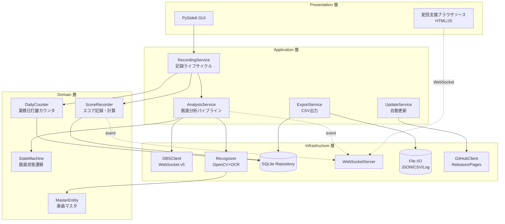
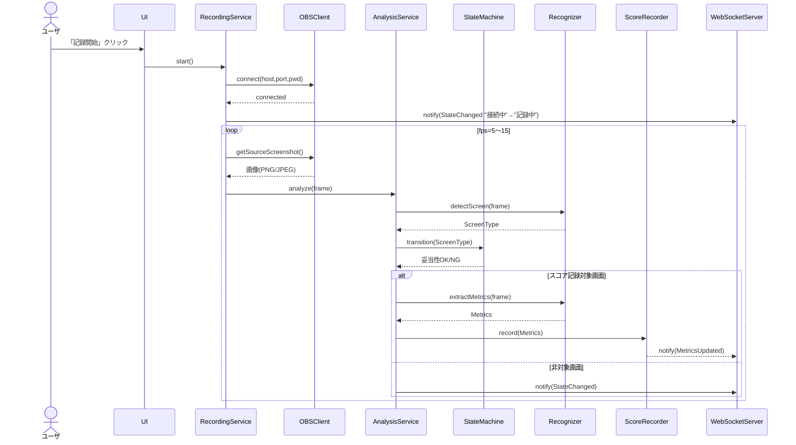
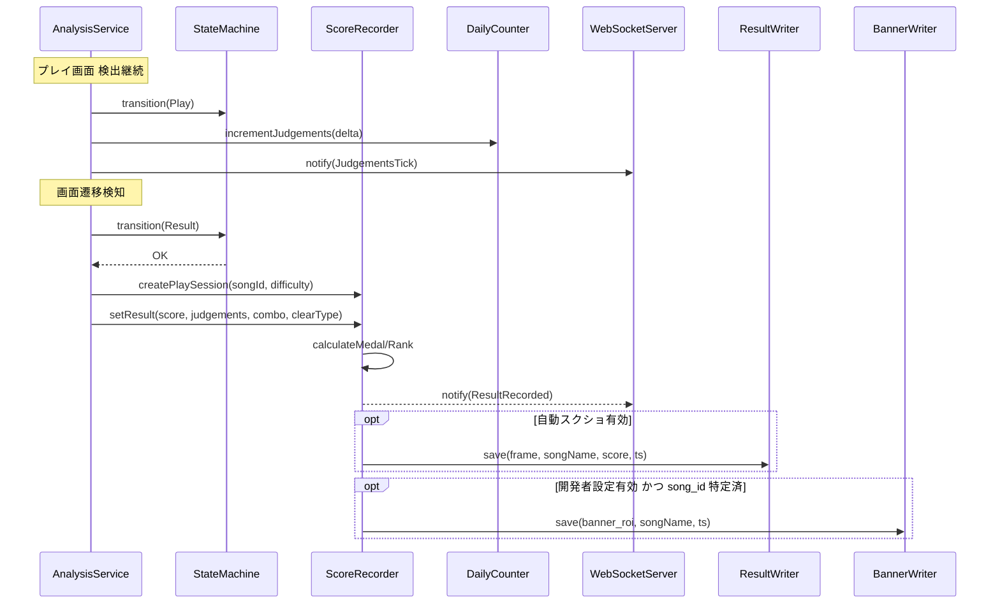
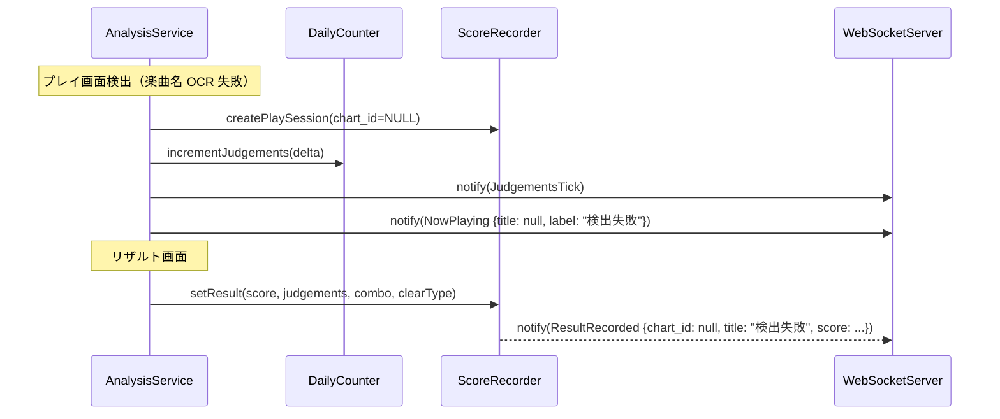
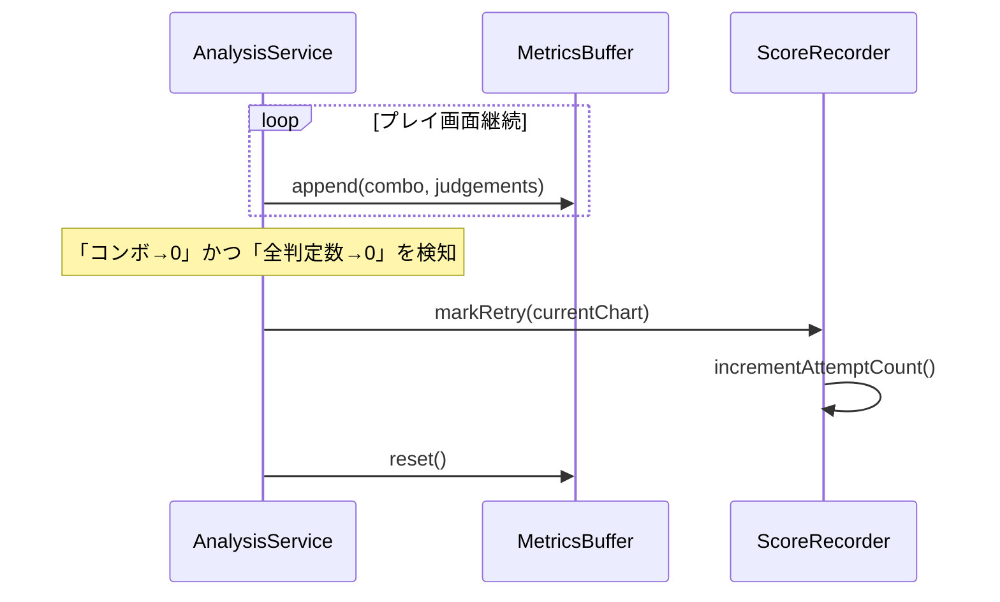
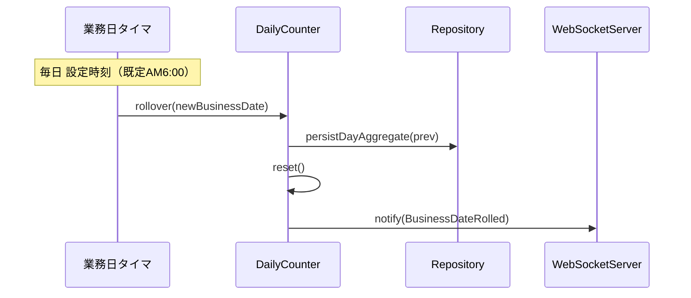
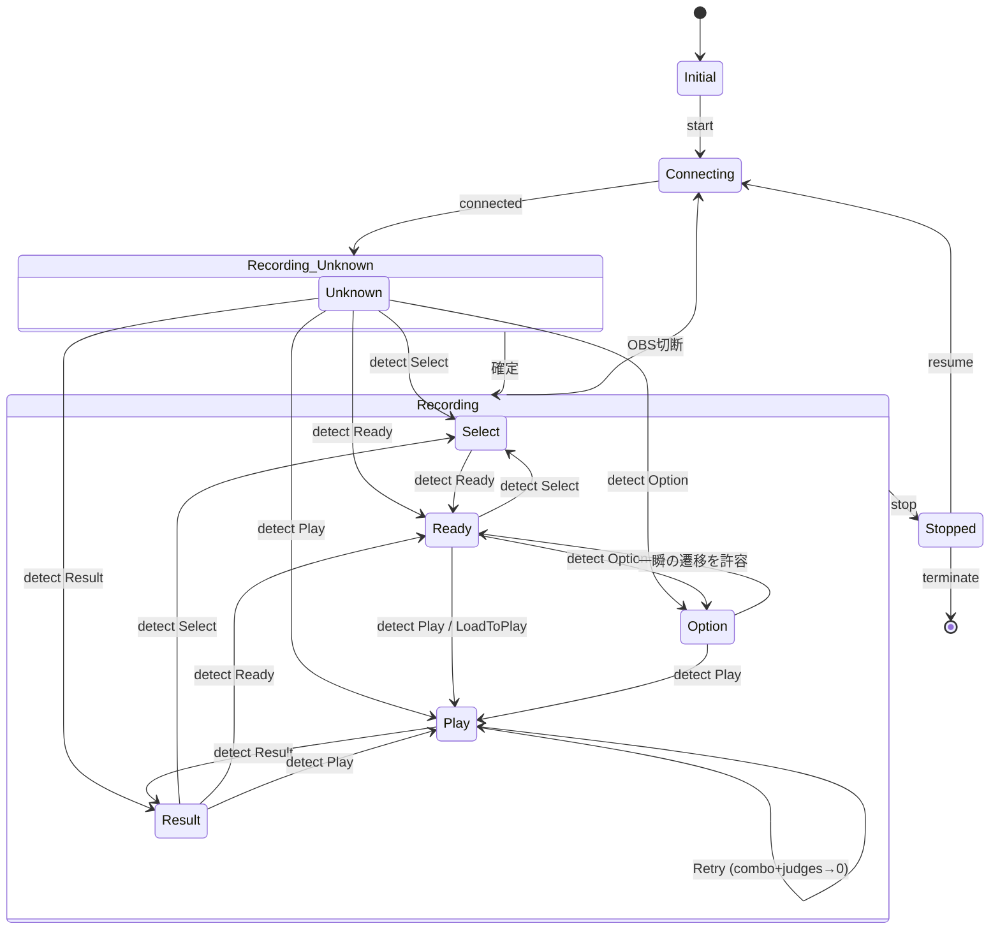
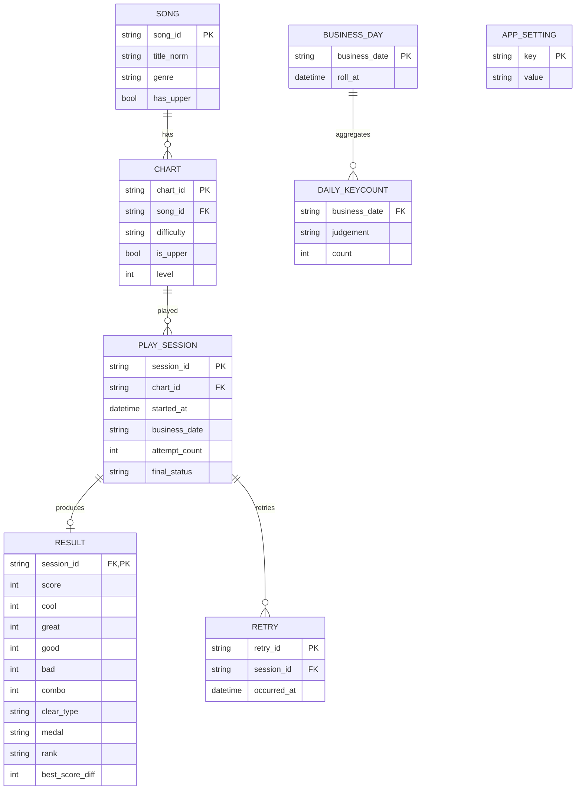
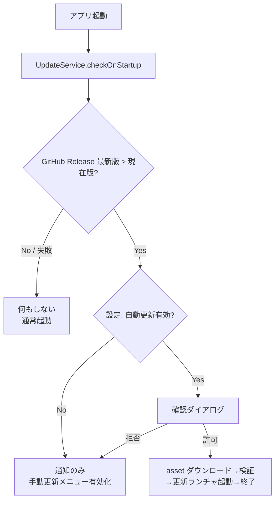

# 基本設計書

| 項目 | 内容 |
|------|------|
| プロダクト名 | LivelyRec |
| 版数 | 0.1（ドラフト） |
| 作成日 | 2026-05-18 |
| 文書ステータス | レビュー前 |
| 前提資料 | `01_プロジェクト計画書.md`、`02_要件定義書.md`、`03_用語集.md`、`04_リスク・課題管理表.md`、`00_要件.md`、`tests/fixtures/sample/` |

> 本書は要件定義書を入力として、システム全体の構造・主要な振る舞い・データモデル・外部 I/F を確定する。詳細実装（クラス内部、関数シグネチャ、エラー文言など）は詳細設計書に持ち越す。

---

## 1. アーキテクチャ概要

### 1.1. レイヤ構成

LivelyRec はクリーンアーキテクチャ風の4層構造とする。GUI（PySide6）と各種 I/O から独立した「ドメイン層」を中核に置き、画像認識・OBS連携・永続化・WebSocket Server をそれぞれ独立した境界モジュールに切り出す。



### 1.2. プロセス構成

- 単一プロセス。PySide6 のメインイベントループ上で動作。
- 画像認識パイプラインは `QThreadPool` 上のワーカに分離し、UI スレッドをブロックしない。
- WebSocket Server は `asyncio` を別スレッドで起動し、ドメイン層から `queue` 経由でイベントを送り込む。

### 1.3. ディレクトリ・モジュール構成（暫定）

```
lively_rec/
├── livelyrec/                    # メインパッケージ
│   ├── app.py                    # アプリエントリ
│   ├── ui/                       # PySide6 ウィジェット・ダイアログ
│   ├── application/              # サービス（RecordingService 等）
│   ├── domain/
│   │   ├── state.py              # StateMachine
│   │   ├── score.py              # ScoreRecorder, 譜面ID
│   │   ├── daily_counter.py      # 業務日打鍵カウンタ
│   │   ├── master.py             # 楽曲マスタ
│   │   └── rank_medal.py         # クリアランク・メダル算出
│   ├── infrastructure/
│   │   ├── obs_client.py
│   │   ├── recognizer/           # 画面ごとの認識モジュール
│   │   │   ├── base.py
│   │   │   ├── select_screen.py
│   │   │   ├── ready_screen.py
│   │   │   ├── option_screen.py
│   │   │   ├── play_screen.py
│   │   │   ├── result_screen.py
│   │   │   └── load_screen.py
│   │   ├── ocr/
│   │   │   ├── base.py
│   │   │   ├── paddle.py
│   │   │   └── tesseract.py
│   │   ├── repository/
│   │   │   ├── schema.py         # SQLite スキーマ定義
│   │   │   └── repo.py           # CRUD
│   │   ├── websocket_server.py
│   │   ├── github_client.py
│   │   ├── config_store.py       # 設定永続化（平文 JSON）
│   │   ├── result_writer.py      # リザルト自動スクリーンショット出力（FR-REC-046）
│   │   ├── banner_writer.py      # 開発者向けバナー画像出力（FR-DEV-002）
│   │   └── filename_sanitizer.py # 楽曲名のファイル名サニタイズ（FR-REC-047）
│   └── shared/                   # ロガー、定数、例外
├── browser_source/               # 配信支援ブラウザソース（HTML/JS、独立4ソース構成）
│   ├── keycount/                 # /keycount: 打鍵数カウンタ
│   ├── now_playing/              # /now-playing: 現在のプレイ楽曲
│   ├── now_playing_history/      # /now-playing-history: 直近プレイ楽曲のスコア履歴
│   └── recent/                   # /recent: 直近のプレイスコア履歴 10 件
├── scripts/
│   └── build_master.py           # マスタ生成スクリプト
├── tests/                        # pytest
└── docs/                         # 本ドキュメント群
```

---

## 2. 主要フロー（シーケンス図）

### 2.1. 記録開始〜画面判別〜記録継続



### 2.2. プレイ画面 → リザルト画面（正常）



楽曲名検出失敗時の挙動（FR-REC-039 / FR-STR-008）:



### 2.3. プレイ画面リトライ検知



### 2.4. 業務日切替



---

## 3. 画面状態遷移と判別ロジック

### 3.1. 状態マシン

00_要件.md §状態遷移 を実装可能形式に落としたもの。



### 3.2. 判別の優先順位（画面ごとの特徴とロジック）

サンプル画像から抽出した不変的なランドマーク（位置・色・テンプレート）を順に評価。**先勝ち** で確定し、矛盾時は状態マシンの妥当性チェックで棄却する。

| 優先 | 画面 | 主要ランドマーク | 補助ランドマーク | 検出手法 |
|------|------|------------------|-----------------|----------|
| 1 | プレイ画面前ロード | 「Let's enjoy music!」全画面表示 | 黒背景＋ロゴ色 | テンプレートマッチング |
| 2 | 準備画面前ロード | 9タイルロゴ（Music Select / Option Select 等の混在） | — | テンプレートマッチング |
| 3 | プレイ画面 | 画面上部に黒帯＋白文字楽曲名／下部固定位置のスコア＋判定数表示 | 中央譜面レーン縦縞、SPEEDインジケータ | エッジ検出＋色マスク＋固定座標 |
| 4 | リザルト画面 | 中央左下に「SCORE / COOL / GREAT / GOOD / BAD / COMBO / BEST SCORE」の縦並びテキスト群 | 上部のクリア種類ラベル（Stage Clear / Failed） | テンプレートマッチング＋OCR |
| 5 | オプション画面 | 縦長リストに「HI-SPEED X.X」テキストが等間隔で並ぶ | 右側のミニ楽曲情報 | テンプレートマッチング |
| 6 | 準備画面 | 中央付近の「Option Select」見出しテキスト＋下部の難易度プログレスバー | 楽曲バナー左上 | テンプレートマッチング |
| 7 | 選曲画面 | 右上「Music Select」ロゴ／左の楽曲リストの縦縞構造 | カーソル位置の譜面ハイライト | テンプレートマッチング |

> ロード画面（前ロード/後ロード）は **状態遷移の補助** として検知し、データ記録イベントは発火しない。

### 3.3. プレイ画面のサブ状態：「Are you ready?」

プレイ画面サブ状態として `Play.Ready` を内部状態に持たせる。
- 譜面レーン中央に「Are you ready?」のテンプレートマッチで判定。
- このサブ状態の間は判定数増分を**計上しない**（誤検出防止）。

### 3.4. 状態妥当性検証

00_要件.md の状態遷移表を `(from, to) → allowed` の集合として保持。`Recording_Unknown` 状態から初回確定までは任意遷移を許可、それ以降は許可されない遷移を **3 連続フレームで観測した場合のみ** 受け入れる（誤検出フレームを吸収）。

---

## 4. 画像認識方式設計

### 4.1. パイプライン

1. **キャプチャ取得**: OBS から JPEG/PNG を取得し、numpy 配列へデコード。
2. **正規化**: ゲーム描画領域の検出（4辺の黒帯トリミング／既知のアスペクト比 16:9 へのリサイズ）。これで OBS シーンに含まれる装飾枠の影響を吸収する。
3. **画面判別**: §3.2 のテンプレートマッチング群を解像度正規化後の座標基準で実行。
4. **領域抽出**: 画面ごとに事前定義したROI（Region of Interest）を切り出し。
5. **メトリクス抽出**: 各 ROI に対し OCR ／ 色マスク ／ テンプレートマッチを適用。

### 4.2. ROI の定義方針

ROI は **「正規化後の 1920×1080 座標系」を基準** に固定値で定義する。実画像はリサイズ後にこの座標系へ写像される。各ROIは `(画面種, 用途, 座標, 抽出方法)` の組で `recognizer/<screen>.py` に保持する。

### 4.3. プレイ画面のメトリクス抽出

| 抽出対象 | 領域（概念位置） | 手法 |
|----------|------------------|------|
| 楽曲名 | 画面上部の黒背景白文字バー | 黒帯マスク→白文字抽出→PaddleOCR |
| COOL 累計数 | 下部右側の数字（COOL ラベル付近） | 色マスク（赤紫 H≈300）→二値化→OCR or 数字テンプレ |
| GREAT 累計数 | 同（黄 H≈55） | 同上 |
| GOOD 累計数 | 同（赤 H≈0） | 同上 |
| BAD 累計数 | 同（水色 H≈190） | 同上 |
| SCORE（途中表示が無いタイトルの場合はリザルトで取得） | プレイ中の SCORE 表記 | OCR |
| COMBO | 「COMBO」近接の数字 | OCR |
| SPEED | 画面右下「SPEED ×x.x = NNN」 | OCR（必須項目ではない） |
| ジャンル名 | 画面上部の小さなテキスト | OCR（補助情報、楽曲特定のスコアリングに利用） |

### 4.4. リザルト画面のメトリクス抽出

| 抽出対象 | 領域 | 手法 |
|----------|------|------|
| クリア種類 | 上部中央の大型ラベル（Stage Clear / Failed / PERFECT / FULL COMBO） | 色＋テンプレートマッチ |
| スコア | 「SCORE」ラベル右の数字 | OCR（数字限定） |
| 各判定数（COOL/GREAT/GOOD/BAD） | 各ラベル右の数字 | OCR（数字限定） |
| コンボ数 | 「COMBO」ラベル右の数字 | OCR |
| 楽曲名・難易度 | バナー上部の「difficulty + song banner」 | 難易度ラベル：色＋テンプレ、楽曲名：プレイ画面で取得済みのキャッシュを優先採用 |
| BEST SCORE 差分 | 「BEST SCORE - / +」 | OCR（参考情報） |

> 楽曲名はリザルト画面のバナー画像（装飾あり・OCRが難）よりも、**直前のプレイ画面で取得済みの楽曲名** を優先する設計とする（R-001 への対応）。

### 4.5. 楽曲特定アルゴリズム

```
入力: 抽出文字列 raw, 補助情報（ジャンル名, 難易度ラベル）
1. raw を正規化: 全角/半角統一、空白除去、記号正規化
2. マスタ内の各楽曲との文字列類似度（Levenshtein or RapidFuzz）を計算
3. ジャンル一致 +0.2、難易度ラベル一致 +0.1 等のスコアブースト
4. 上位2件のスコア差 ≥ 閾値の場合に確定、それ以外は「未特定」
5. UPPER譜面候補がある場合、難易度ラベルに「UPPER」表記の有無で分岐
```

閾値は基本設計PoCで実測値からチューニング。

### 4.6. 二値化が必要な数字の前処理（判定数）

各判定の色を HSV 空間で抽出 → グレースケール化 → モルフォロジー処理（オープニング）でノイズ除去 → 二値化 → OCR。

| 判定 | H 範囲 | S/V 閾値（暫定） |
|------|--------|------------------|
| COOL（赤紫） | 280–320 | S>120, V>120 |
| GREAT（黄） | 40–70 | S>120, V>120 |
| GOOD（赤） | 0–10, 350–360 | S>120, V>120 |
| BAD（水色） | 170–200 | S>120, V>120 |

実値は PoC で確定。

### 4.7. リトライ検出

連続フレームでプレイ画面の `(score, combo, cool, great, good, bad)` をリングバッファに保持。前フレームの値がすべて非ゼロ → 当該フレームで `combo == 0 AND cool==great==good==bad==0` への遷移を観測した場合に **リトライイベント** として確定。ロード画面 1〜数フレームの挿入は許容。

### 4.8. OCR エンジン選定 PoC

| 項目 | 内容 |
|------|------|
| 目的 | PaddleOCR と Tesseract の認識精度・速度を実画像で比較し、第一採用エンジンを確定 |
| 入力 | `tests/fixtures/sample/` 内の全画像（特にプレイ画面の楽曲名・各判定数、リザルト画面のスコア・判定数） |
| 評価指標 | (1) 文字認識正答率（楽曲名は exact match と類似度 0.9 以上の2基準）、(2) 数字認識正答率、(3) 1画像あたり処理時間 |
| 合格基準 | 楽曲名 ≥95%、数字 ≥99%、平均処理時間 ≤200ms/枚（M2クラス相当のPC） |
| 採用判断 | 双方が合格基準を満たす場合は処理速度の高い方を採用、片方のみ満たす場合はそちらを採用、両方が満たさない場合はテンプレートマッチング主体への切替を検討 |
| 期限 | 基本設計工程末 |

---

## 5. データモデル（SQLite）

### 5.1. ER 概念図



### 5.2. テーブル定義（要点）

詳細なカラム型・制約は詳細設計に持ち越す。基本設計時点では下記を確定する。

- **`song`**: 楽曲マスタのスナップショット。マスタ JSON 取得時に upsert。
- **`chart`**: 楽曲×難易度の譜面。`(song_id, difficulty, is_upper)` でユニーク。
- **`play_session`**: プレイの試行。リトライしても同一セッション継続とは限らないため、プレイ画面突入を新セッションとする方針（リトライは `attempt_count` カウントアップ）。
- **`result`**: リザルト画面で取得した値。スキップされた場合は不在（PlaySessionのみ残る）。
- **`retry`**: 各リトライ発生時刻のログ。配信支援表示で利用。
- **`business_day` / `daily_keycount`**: 業務日単位の累計判定数。
- **`app_setting`**: アプリ設定の Key-Value 永続化。OBSパスワードは DPAPI 暗号化済みの値を保存する。

### 5.3. データ保持期間

無期限保持（個人利用、容量影響は軽微）。将来必要であれば「N日経過 → 集計値のみ残してセッション削除」の運用を別途検討。

---

## 6. 楽曲マスタ設計

### 6.1. マスタ JSON フォーマット（暫定）

```json
{
  "version": "2026-05-18T00:00:00Z",
  "songs": [
    {
      "song_id": "popn-12345",
      "title": "ぽぽぽかレトロード",
      "title_norm": "ぽぽぽかれとろーど",
      "genre": "ぽかぽかレトロード",
      "has_upper": false,
      "charts": [
        {"difficulty": "EASY",   "level": 8},
        {"difficulty": "NORMAL", "level": 24},
        {"difficulty": "HYPER",  "level": 36},
        {"difficulty": "EX",     "level": 42}
      ]
    }
  ]
}
```

- `title_norm` は楽曲特定アルゴリズムの正規化済み文字列（ひらがな化・記号除去等）。
- UPPER 譜面がある楽曲では別 `song_id` ではなく、`charts[]` に `"difficulty": "UPPER", "is_upper": true` のエントリを持たせる。

### 6.2. 配布と取得

- 配布: GitHub Pages の静的 JSON。バージョンはファイル末尾のタイムスタンプとレスポンス ETag。
- 取得: アプリ起動時に HEAD ETag を確認、変化があれば本体取得→ローカル `master.json` 上書き→`song` / `chart` テーブル upsert。
- 失敗時: ローカルキャッシュ継続使用。UI に警告アイコンのみ表示。

### 6.3. マスタ生成スクリプト

`scripts/build_master.py`:
- 公式「収録楽曲一覧」を一次ソースとしてスクレイピング（HTML 解析）。
- 上級攻略Wiki の難易度表を二次ソースとして難易度値を補完。
- 取得サイトの利用規約・robots.txt を尊重し、リクエスト間隔を空ける。
- 生成物は手動レビュー → リポジトリへ PR → GitHub Pages へデプロイ。

---

## 7. 外部 I/F 設計

### 7.1. OBS WebSocket クライアント

- ライブラリ: `obs-websocket-py`（同期, v5 対応）。
- 主要オペレーション: `GetSourceScreenshot`（ゲームソース名は設定で指定）、`Connect`、`Disconnect`。
- 失敗時: 指数バックオフで最大 5 回再接続、それ以降は手動再接続待ち。

### 7.2. アプリの WebSocket Server

| 項目 | 設計 |
|------|------|
| エンドポイント | `ws://<host>:<port>/v1` （`v1` はメジャーバージョン） |
| 既定バインド | `127.0.0.1:14514`（pop'n の象徴的数字を仮採用、設定で変更可） |
| 認証 | 既定: なし（localhost のみ）。LAN公開設定 ON のとき: トークン認証必須（接続時 `Authorization` ヘッダー or 初回フレーム） |
| メッセージ形式 | JSON。`{"type": "...", "ts": "...", "payload": {...}}` |
| 通知メッセージ型 | `state.changed` / `judgements.tick` / `play.started` / `play.retry` / `result.recorded` / `business_day.rolled` |
| 要求メッセージ型 | `chart.history`（過去リザルト要求）／`daily_keycount.get` |
| バックプレッシャ | クライアントが追従しない場合は送信キューを 100 件で打ち切り、古いものから破棄＋警告ログ |

詳細スキーマは詳細設計で確定。

### 7.3. ファイル書き出し（外部連携）

- 出力先: 設定で指定するディレクトリ。
- 書き出しタイミング: 主要イベント発生時にアトミックに上書き（`tmp → rename`）。
- 出力ファイル:
  - `current_state.json` ── 現在画面・カーソル譜面・打鍵累計
  - `latest_result.json` ── 直近のリザルト1件
  - `daily_keycount.json` ── 当日業務日の累計

### 7.4. GitHub Releases / Pages

- Releases API: `GET /repos/<owner>/<repo>/releases/latest`。レート制限内（未認証 60req/h）で十分。
- Pages: 静的 JSON 取得のみ。HTTPS 必須。

---

## 8. 配信支援ブラウザソース設計

### 8.1. 構成（v1.x: 4ソース独立配信）

ブラウザソースは用途ごとに **独立した URL** として配信する（FR-STR-007）。v1.x で **既存の単一 URL（`/browser/index.html` 等）は廃止** し、以下 4 パスに移行する（FR-STR-010）。

| パス | 用途 | データソース | 備考 |
|------|------|--------------|------|
| `/browser/keycount/` | 打鍵カウンタ + 時系列グラフ | `judgements.tick`, `business_day.rolled` | FR-STR-002 / FR-STR-003 |
| `/browser/now-playing/` | 現在のプレイ楽曲 | `play.started`, `chart.selected`, `result.recorded` | 楽曲名未特定時は **「検出失敗」** を表示（FR-STR-008） |
| `/browser/now-playing-history/` | 「直近プレイ楽曲」のスコア履歴（日付・スコア） | `chart.history.response`（直近プレイ楽曲の `chart_id` を起点に要求） | 選曲画面検出未実装のためプレースホルダ（FR-STR-004） |
| `/browser/recent/` | DB 全履歴から最新 10 件のプレイスコア履歴 | `recent.history.response`（新規メッセージ、§8.3 参照） | 件数 10 件固定（FR-STR-009） |

- 各ページは独立した HTML/JS で構成し、OBS のブラウザソースに個別追加する。
- 既存の `index.html` は v1.x 移行時に削除し、移行ガイドをマニュアルへ記載。
- WebSocket 接続は 4 ソースそれぞれが独立に張る（共通 endpoint `ws://<host>:<port>/v1`、購読対象が異なる）。

### 8.2. 各ソースの表示要素

| ソース | 表示要素 |
|--------|----------|
| keycount | 判定別打鍵数（COOL/GREAT/GOOD/BAD）、総打鍵数、直近 N 分の時系列グラフ |
| now-playing | 楽曲名、難易度、ジャンル、レベル。検出失敗時は固定文言「検出失敗」 |
| now-playing-history | 楽曲名（プレースホルダの「直近プレイ楽曲」）、過去プレイの日時・スコア・ランクの一覧 |
| recent | プレイ日時・楽曲名（未特定時は「検出失敗」）・スコア・難易度・ランクの 10 件タイル |

### 8.3. メッセージ追加要件

- **`recent.history.response`**（新規）: `/browser/recent/` が初回接続時に要求する全履歴最新 10 件の応答。詳細スキーマは `08_詳細設計_API設計.md` で確定する。
- リザルト記録時に **新規 `result.recorded` をブロードキャスト** することで `/browser/recent/` 側がリストの先頭に追加し、末尾を切り捨てる（push-based 更新）。

### 8.4. カスタマイズ

- 各ページの HTML 内に外部 CSS リンクを 1 枠用意し、ユーザが独自 CSS を当てられる構成。
- 主要要素には `data-*` 属性とクラス名を付与（NFR-MAINT-001／FR-STR-005 準拠）。

---

## 9. 横断機能設計

### 9.1. ポータブル構成

LivelyRec は **常時ポータブル構成** で動作する（NFR-OPS-004）。ユーザデータはすべて配布フォルダ直下の `livelyrec_data/` 配下に集約する。`%APPDATA%` 等のユーザディレクトリは使用しない。

```
<配布フォルダ>/
├── LivelyRec.exe
├── _internal/
├── browser_source/
├── templates/
└── livelyrec_data/         <- 全ユーザデータ
    ├── settings.json
    ├── db/livelyrec.sqlite3
    ├── logs/YYYY-MM-DD.log
    ├── export/...
    └── crash/...
```

- データパスの基準は `Path(sys.executable).parent / "livelyrec_data"`。開発時は `pyproject.toml` のあるリポジトリルート / `livelyrec_data` をフォールバック。
- 起動時に書込み可否をチェックし、不可なら明確なエラーメッセージで「ユーザディレクトリ配下に展開してください」と案内（NFR-OPS-005）。

### 9.2. 設定管理

- 設定ファイル: `livelyrec_data/settings.json`
- センシティブ値（OBS パスワード、WebSocket トークン）も **平文で保存**。ポータブル運用優先のため暗号化は採用しない（NFR-SEC-001）。
- 代替対策:
  - 設定UIで「設定ファイルを共有する際はパスワードを削除してください」と**常時警告表示**
  - 「保存しない（毎起動入力）」オプションも提供
- スキーマバージョンを保持し、将来移行を可能にする。

### 9.3. ロギング

- ライブラリ: 標準 `logging` + ファイルローテーション（日次・最大30日保持）。
- 出力先: `livelyrec_data/logs/YYYY-MM-DD.log`。
- レベル: INFO 既定、設定でDEBUG切替可。
- マスク: パスワード・トークンはマスクしてログ出力。

### 9.4. エラー処理方針

- **回復可能エラー**（OBS切断、マスタ取得失敗、画像認識1フレーム失敗）: ログ記録のみ、ユーザ非通知で処理継続。
- **回復不可能エラー**（DB破損、設定読込不能）: モーダルでユーザに通知、安全な状態で停止。
- **未捕捉例外**: グローバルハンドラでクラッシュレポートを `crash_YYYYMMDD_HHMMSS.log` に保存、再起動を促す。

### 9.5. 自動アップデート設計



- 検証: ダウンロード後のハッシュをリリースノートに記載のチェックサムと照合。
- アップデート時は **`livelyrec_data/` フォルダを残し、その他のファイルのみを置換** する。

### 9.6. 業務日切替の実装方針

- 起動時に「現在の業務日」を計算（現在時刻 < 設定切替時刻 ならば前日扱い）。
- `QTimer` で次の切替時刻にシングルショットでロールオーバー発火。設定変更時に再スケジュール。
- 起動中にPCがスリープ→復帰した場合に切替時刻を跨いでいたら、起動後の最初のティックで補正実行。

### 9.7. リザルト画面の自動スクリーンショット（FR-REC-046〜048）

- **撮影タイミング**: リザルト画面で **スコア検出の安定（`_ResultStabilizer` 確定）と同時** に 1 回保存（I-017 で確立した安定化機構を流用）。楽曲名未特定（chart_id=NULL）でも保存する。
- **対象画像**: OBS から取得し正規化処理（`10_詳細設計_画像認識.md` §2）を通したフレーム（1366×768 BGR）を **そのまま PNG エンコード** して保存。装飾枠は事前にトリミング済みのため「ゲーム領域」のみが保存される。
- **保存先**: 既定 `<配布フォルダ>/livelyrec_data/result/`。設定で任意パスへ変更可（書込み権限がないパスを指定したら起動時／設定保存時に検証エラー）。
- **ファイル名**: `YYYY-MM-DD_HH-mm-ss_<sanitized_title>_<score>.png`。サニタイズ規約は §9.9 を参照。
- **衝突回避**: 既存ファイルと衝突した場合は `_2`, `_3` ... の連番を末尾（拡張子手前）に付与。
- **失敗時の挙動**: ディスク容量不足／書込み権限不可は WARN ログを残して **本体動作は継続**（記録機能優先）。

### 9.8. 開発者向けバナー画像保存（FR-DEV-002〜004）

- **有効条件**: 設定 `developer.banner_capture_enabled = true` のとき、リザルト画面到達時に動作。既定 false。
- **撮影タイミング**: §9.7 と同じ。リザルトの自動スクリーンショットと **同一フレーム** からバナー領域を切り出して保存。
- **クロップ領域**: `10_詳細設計_画像認識.md` で新規定義する `RESULT_ROI["banner"]` を採用。
- **保存先**: 既定 `<配布フォルダ>/livelyrec_data/banner/`。設定で任意パスへ変更可。
- **ファイル名**: `YYYY-MM-DD_HH-mm-ss_<sanitized_title>_banner.png`（楽曲名未特定時は `unknown`）。
- **重複ポリシー**: 同一楽曲を複数回プレイしても **プレイ毎に全保存**（学習データの多様性確保）。

### 9.9. ファイル名サニタイズ規約（FR-REC-047）

- OS 禁止文字 `<>:"/\|?*` および ASCII 制御文字（0x00-0x1F）を **削除** する。
- 先頭・末尾の空白とドットも削除（Windows のファイル名規約による）。
- サニタイズ後に空文字となった場合は `unknown` を採用。
- 長さは UTF-8 バイト数で 80 バイトを上限とし、超過時は末尾を切り詰める（パス長対策、Windows MAX_PATH 余裕確保のため）。

### 9.10. 開発者設定セクション（FR-DEV-001）

- 設定ダイアログの末尾に **折りたたみ式の「開発者設定」セクション** を配置。既定は折りたたまれた状態。
- 注意文として「この機能は LivelyRec の認識精度向上のための実験的機能です。データの保存先容量に注意してください」を併記。
- 設定項目: `developer.banner_capture_enabled`（bool, 既定 false）、`developer.banner_dir`（path, 既定 `livelyrec_data/banner/`）。

---

## 10. パフォーマンス・スレッド設計

| スレッド | 担当 | ライブラリ |
|----------|------|------------|
| メインスレッド | PySide6 UI、状態マシン、軽量ドメイン処理 | PySide6 |
| 認識ワーカ（QThreadPool） | キャプチャ取得→画像認識パイプライン | QRunnable |
| WebSocket スレッド | asyncio loop、Server | websockets + asyncio |
| 更新スレッド | GitHub API、ダウンロード | requests + threading |

- 認識ワーカは多重実行せず単一に絞る（フレームをキューイングし、追いつかない場合は古いフレームをドロップ）。
- UI ↔ ワーカ間は `pyqtSignal/slot` で安全に通信。

---

## 11. テスト方針（基本設計時点）

- 画面判別・メトリクス抽出の単体テストは `tests/fixtures/sample/` を入力にした **データ駆動テスト** とする。
- OCR エンジンの差し替えに耐えるため、テストは `OCREngine` インタフェース層で固定 → 認識モジュール側のロジックを検証。
- 結合テストでは「実プレイ録画の連続フレーム」をリプレイ可能なテストハーネスを用意（詳細設計で具体化）。

---

## 12. セキュリティ設計（補足）

- WebSocket Server のトークン: 32バイト乱数を Base64 化、ユーザがUI上から取得・再生成可。
- ログにトークン・パスワードを出力しない（`shared/logging_filter.py` で正規表現マスク）。
- 自動更新時の HTTPS 証明書検証は明示的に有効化（`verify=True`）。

---

## 13. 制約・前提（基本設計時点）

- ゲームソースは OBS 上で 16:9 のアスペクト比で表示されている前提。クロップ枠・装飾枠付与は正規化処理で吸収可能。
- 配信支援ブラウザソースのレンダリングは OBS の Chromium バージョンに依存。Modern ECMAScript（ES2020相当）は使用可能と仮定。
- マスタ生成スクリプトは開発者運用ツール。エンドユーザは実行しない（配布物に含めない）。

---

## 14. 詳細設計に持ち越す事項

| # | 項目 | 持ち越し理由 |
|---|------|--------------|
| 14.1 | OCRエンジン最終決定 | **PaddleOCR 2.7.3 を条件付き採用**（PoC #01 完了、`docs/design/poc/01_ocr_engine_selection.md` 参照）。領域限定OCRの実測PoCを詳細設計工程で実施 |
| 14.2 | SQLite カラム型・インデックス設計 | クエリパターン確定後 |
| 14.3 | WebSocket メッセージスキーマの全項目定義 | クライアント側設計と平行 |
| 14.4 | 各画面 ROI の座標確定 | 実画像での試行が必要 |
| 14.5 | クリアメダル・クリアランク算出ロジックの実装詳細 | 外部Wiki仕様の精読→実装表化 |
| 14.6 | UI のウィジェット構成・画面遷移 | UI設計で別途検討 |
| 14.7 | クラッシュレポートの送信／非送信ポリシー | プライバシ観点を含む |

---

## 15. 承認

| 役割 | 氏名 | 日付 | 結果 |
|------|------|------|------|
| プロダクトオーナー | （ユーザ） | YYYY-MM-DD | 承認／差戻し |

---

## 改訂履歴

| 版 | 日付 | 内容 | 改訂者 |
|----|------|------|--------|
| 0.1 | 2026-05-18 | 初版作成（要件定義書 v0.2 を入力に作成） | Claude Code |
| 0.2 | 2026-05-18 | PoC #01 完了に伴い §14.1 を更新（PaddleOCR 2.7.3 条件付き採用） | Claude Code |
| 0.3 | 2026-05-18 | ポータブル構成方針確定に伴い §9 を再構成（§9.1 ポータブル構成を新設、設定/ログ/自動更新を見直し） | Claude Code |
| 0.4 | 2026-05-27 | v1.x 機能追加（要件 v0.6 反映）: モジュール構成にスクショ/バナー writer を追加、§2.2 にバナー保存と検出失敗フローのシーケンス、§8 をブラウザソース 4 URL 構成に書換、§9.7〜9.10 で自動スクショ/バナー画像/サニタイズ/開発者設定セクションを規定 | Claude Code |
