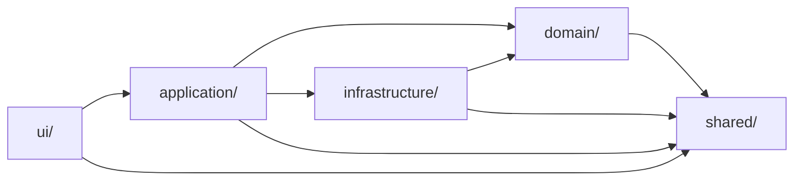
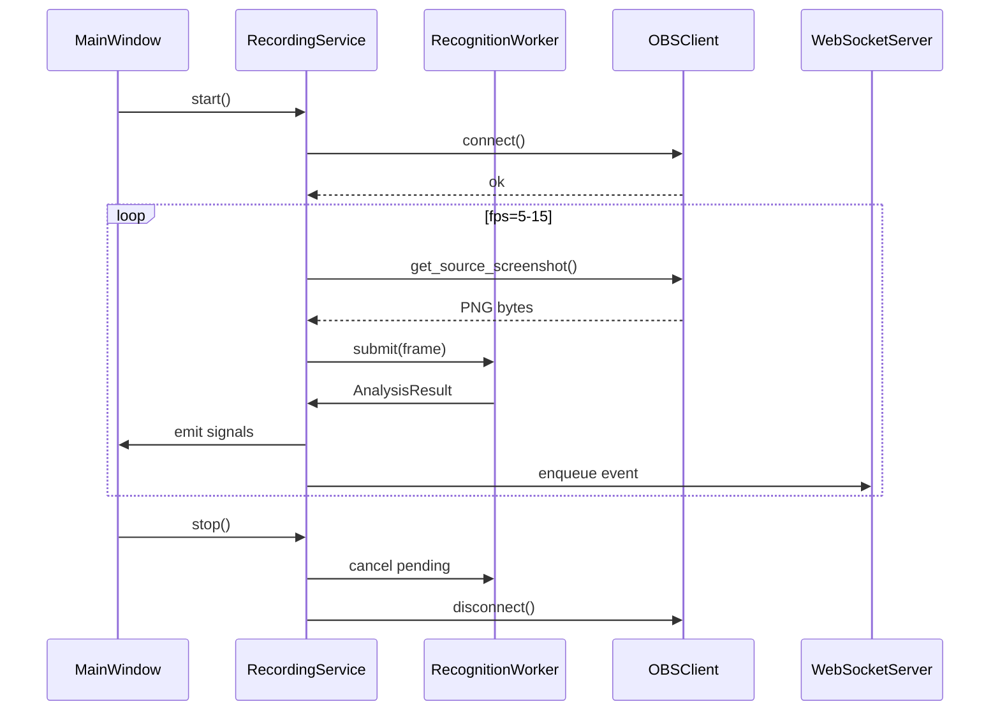

# 詳細設計書: アーキテクチャ編

| 項目 | 内容 |
|------|------|
| プロダクト名 | LivelyRec |
| 版数 | 0.1（ドラフト） |
| 作成日 | 2026-05-18 |
| 関連資料 | `05_基本設計書.md`、PoC #01-#03（`docs/design/poc/`） |

> 本書は基本設計書の §1 アーキテクチャ概要、§9 横断機能、§10 スレッド設計を実装着手可能なレベルに詳細化する。クラスの公開シグネチャ・モジュール依存方向・例外処理・ロギング・設定永続化までを確定する。

---

## 1. モジュール構成（確定版）

```
livelyrec/                          # メインパッケージ
├── app.py                          # エントリポイント（QApplication起動）
├── ui/
│   ├── __init__.py
│   ├── main_window.py              # MainWindow（QMainWindow）
│   ├── settings_dialog.py          # 設定ダイアログ
│   ├── widgets/
│   │   ├── connection_panel.py     # OBS接続状態パネル
│   │   ├── record_status_panel.py  # 記録状態・現在画面パネル
│   │   ├── daily_counter_panel.py  # 業務日打鍵カウンタ表示
│   │   └── recent_results_panel.py # 直近リザルト履歴
│   └── viewmodels/
│       └── recording_vm.py         # PySide6 ViewModel（QObject + Signals）
├── application/
│   ├── __init__.py
│   ├── recording_service.py        # 記録ライフサイクル管理
│   ├── analysis_service.py         # 画面分析パイプライン
│   ├── update_service.py           # 自動アップデート
│   └── export_service.py           # CSV出力
├── domain/
│   ├── __init__.py
│   ├── state.py                    # RecordingState, ScreenType, StateMachine
│   ├── score.py                    # Chart, PlaySession, Result
│   ├── daily_counter.py            # DailyCounter, business_date
│   ├── master.py                   # Song, MasterRepository
│   └── rank_medal.py               # clear_rank(), clear_medal()
├── infrastructure/
│   ├── __init__.py
│   ├── obs_client.py               # OBS WebSocket v5 クライアント
│   ├── recognizer/
│   │   ├── __init__.py
│   │   ├── base.py                 # ScreenRecognizer (ABC)
│   │   ├── pipeline.py             # RecognitionPipeline
│   │   ├── normalize.py            # 解像度正規化（1366x768→1366x768だがアスペクト補正）
│   │   ├── select_screen.py
│   │   ├── ready_screen.py
│   │   ├── option_screen.py
│   │   ├── play_screen.py
│   │   ├── result_screen.py
│   │   ├── load_screen.py
│   │   └── roi_defs.py             # 全ROI座標定義（10_詳細設計_画像認識参照）
│   ├── ocr/
│   │   ├── __init__.py
│   │   ├── base.py                 # OcrEngine (ABC)
│   │   ├── paddle.py               # PaddleOCR ラッパ + ウォームアップ
│   │   └── digit_template.py       # 数字テンプレートマッチング
│   ├── repository/
│   │   ├── __init__.py
│   │   ├── schema.py               # DDL定義
│   │   ├── migrate.py              # スキーママイグレーション
│   │   ├── song_repo.py
│   │   ├── play_session_repo.py
│   │   ├── result_repo.py
│   │   └── daily_counter_repo.py
│   ├── ws_server.py                # 外部連携 WebSocket Server
│   ├── github_client.py            # Releases API / マスタJSON取得
│   ├── config_store.py             # 設定永続化（平文JSON）
│   ├── paths.py                    # ポータブルパス解決（livelyrec_data/ 基準）
│   ├── result_writer.py            # リザルト自動スクショ出力（FR-REC-046）
│   ├── banner_writer.py            # 開発者向けバナー画像出力（FR-DEV-002）
│   └── filename_sanitizer.py       # 楽曲名のファイル名サニタイズ（FR-REC-047）
└── shared/
    ├── __init__.py
    ├── constants.py                # 定数
    ├── logging_setup.py            # ロガー初期化
    ├── exceptions.py               # 例外階層
    └── time_utils.py               # 業務日計算など
```

---

## 2. 依存方向ルール

### 2.1. 許可される依存



- `domain/` は **どこにも依存しない**（純粋なドメインオブジェクト）。
- `infrastructure/` は `domain/` と `shared/` のみに依存。`application/` を import しない。
- `application/` は `domain/`, `infrastructure/`, `shared/` に依存可。
- `ui/` は `application/` と `shared/` のみに依存。`infrastructure/` を直接 import しない。
- 逆方向（例: `domain/` → `application/`）は **禁止**。

### 2.2. import 強制方法

詳細設計時点では Lint ルール（`ruff`）で `tool.ruff.lint.flake8-tidy-imports` を使い、禁止 import を検出する。

---

## 3. 主要クラスの公開シグネチャ

詳細はモジュール単位の仕様（DB/API/UI/画像認識編）に分けて記す。本書では「層間の I/F」となる主要クラスのみ確定する。

### 3.1. `domain/state.py`

```python
from enum import Enum
from dataclasses import dataclass

class ScreenType(Enum):
    UNKNOWN = "unknown"
    SELECT = "select"
    READY = "ready"
    OPTION = "option"
    PLAY = "play"
    PLAY_READY = "play_ready"        # Are you ready? サブ状態
    RESULT = "result"
    LOAD_TO_PLAY = "load_to_play"
    LOAD_TO_READY = "load_to_ready"

class RecordingState(Enum):
    INITIAL = "initial"
    CONNECTING = "connecting"
    RECORDING_UNKNOWN = "recording_unknown"
    RECORDING = "recording"
    STOPPED = "stopped"

@dataclass(frozen=True)
class StateTransition:
    from_screen: ScreenType
    to_screen: ScreenType
    allowed: bool

class StateMachine:
    def __init__(self) -> None: ...
    def current(self) -> ScreenType: ...
    def transition(self, to: ScreenType) -> bool:
        """戻り値: 受け入れたら True。不正遷移は内部カウンタで吸収"""
    def reset(self) -> None: ...
```

### 3.2. `domain/score.py`

```python
@dataclass(frozen=True)
class Chart:
    song_id: str
    difficulty: str   # EASY / NORMAL / HYPER / EX / UPPER
    is_upper: bool
    level: int | None
    @property
    def chart_id(self) -> str: ...

@dataclass(frozen=True)
class Judgements:
    cool: int
    great: int
    good: int
    bad: int
    @property
    def total(self) -> int: ...

@dataclass(frozen=True)
class Result:
    score: int
    judgements: Judgements
    combo: int
    clear_type: str   # PERFECT / FULL_COMBO / CLEAR / FAILED
    medal: str        # STAR / DIAMOND / CIRCLE / NONE
    rank: str         # S+, S, AAA, ...
    best_score_diff: int | None

@dataclass
class PlaySession:
    session_id: str
    chart: Chart
    started_at: datetime
    business_date: date
    attempt_count: int
    final_status: str   # COMPLETED / FAILED / RETRIED_OUT / SKIPPED
    result: Result | None
```

### 3.3. `application/recording_service.py`

```python
class RecordingService:
    def __init__(
        self,
        obs: OBSClient,
        analysis: AnalysisService,
        repo_session: PlaySessionRepository,
        repo_daily: DailyCounterRepository,
        ws_server: WebSocketServer,
        result_writer: ResultWriter | None = None,
        banner_writer: BannerWriter | None = None,
        clock: Callable[[], datetime] = datetime.now,
    ) -> None: ...

    def start(self) -> None:
        """記録開始。OBS接続→画面分析ループ起動"""

    def stop(self) -> None:
        """記録停止。ループ停止＋日次集計の永続化"""

    def is_recording(self) -> bool: ...

    # 設定ダイアログからの即時反映（I-018 の方針を踏襲）
    def set_result_capture(self, enabled: bool, output_dir: Path | None = None) -> None: ...
    def set_banner_capture(self, enabled: bool, output_dir: Path | None = None) -> None: ...

    # PySide6 シグナル相当のイベント通知
    on_state_changed: Callable[[RecordingState], None]
    on_screen_changed: Callable[[ScreenType], None]
    on_judgements_tick: Callable[[Judgements], None]
    on_result_recorded: Callable[[PlaySession, Result], None]
    on_business_day_rolled: Callable[[date], None]
    on_error: Callable[[Exception], None]
```

### 3.4. `application/analysis_service.py`

```python
class AnalysisService:
    def __init__(
        self,
        pipeline: RecognitionPipeline,
        state_machine: StateMachine,
        master: MasterRepository,
    ) -> None: ...

    def analyze_frame(self, frame_bgr: np.ndarray) -> AnalysisResult:
        """1フレームに対する分析。状態遷移とメトリクス抽出"""

@dataclass
class AnalysisResult:
    screen: ScreenType
    confidence: float
    metrics: dict[str, Any]   # 画面に応じた抽出データ
    raw_song_text: str | None
    identified_chart: Chart | None
    song_identification_failed: bool = False   # 楽曲名 OCR は走ったが特定不能（FR-REC-039）
```

- `identified_chart is None and song_identification_failed=True` のとき: 「検出失敗」として `chart_id=NULL` で `play_session` を作成する。
- `identified_chart is None and song_identification_failed=False` のとき: まだ判定処理が走っていない（プレイ開始直後）状態として扱い、レコードは作成しない。

### 3.5. `infrastructure/recognizer/pipeline.py`

```python
class RecognitionPipeline:
    def __init__(
        self,
        recognizers: dict[ScreenType, ScreenRecognizer],
        ocr: OcrEngine,
        digit_recognizer: DigitTemplateRecognizer,
    ) -> None: ...

    def detect_screen(self, frame: np.ndarray) -> ScreenType: ...
    def extract_metrics(self, frame: np.ndarray, screen: ScreenType) -> dict[str, Any]: ...
```

### 3.6. `infrastructure/result_writer.py`（FR-REC-046〜048）

```python
class ResultWriter:
    def __init__(
        self,
        enabled: bool,
        output_dir: Path,
        sanitizer: FilenameSanitizer,
        clock: Callable[[], datetime] = datetime.now,
    ) -> None: ...

    def is_enabled(self) -> bool: ...
    def set_enabled(self, enabled: bool) -> None: ...
    def set_output_dir(self, output_dir: Path) -> None: ...

    def save(
        self,
        frame_bgr: np.ndarray,
        song_title: str | None,   # None or 空文字なら "unknown"
        score: int | None,        # スコア取得失敗時は "unknown"
        ts: datetime | None = None,
    ) -> Path | None:
        """成功時は保存パス、保存スキップ（disabled）の場合は None。書込失敗時は WARN ログ＋ None"""
```

### 3.7. `infrastructure/banner_writer.py`（FR-DEV-002〜003）

```python
class BannerWriter:
    def __init__(
        self,
        enabled: bool,
        output_dir: Path,
        banner_roi: tuple[int, int, int, int],   # roi_defs.RESULT_ROI["banner"]
        sanitizer: FilenameSanitizer,
        clock: Callable[[], datetime] = datetime.now,
    ) -> None: ...

    def is_enabled(self) -> bool: ...
    def set_enabled(self, enabled: bool) -> None: ...
    def set_output_dir(self, output_dir: Path) -> None: ...

    def save(
        self,
        frame_bgr: np.ndarray,    # 正規化済み 1366x768 BGR
        song_title: str | None,
        ts: datetime | None = None,
    ) -> Path | None:
        """enabled=False または banner_roi 外なら None。それ以外は保存パスを返す"""
```

### 3.8. `infrastructure/filename_sanitizer.py`（FR-REC-047 / 9.9）

```python
class FilenameSanitizer:
    FORBIDDEN = '<>:"/\\|?*'
    MAX_BYTES = 80                # UTF-8 bytes

    def sanitize_title(self, title: str | None) -> str:
        """禁止文字・制御文字を削除し、両端の空白/ドットを除く。
        結果が空なら 'unknown' を返す。UTF-8 80byte で切り詰め"""

    def compose_result_filename(self, ts: datetime, title: str | None, score: int | None) -> str:
        """YYYY-MM-DD_HH-mm-ss_<sanitized>_<score>.png"""

    def compose_banner_filename(self, ts: datetime, title: str | None) -> str:
        """YYYY-MM-DD_HH-mm-ss_<sanitized>_banner.png"""

    def resolve_unique(self, path: Path) -> Path:
        """既存ファイルと衝突したら拡張子手前に _2, _3 ... を付与"""
```

---

## 4. スレッド・並行設計

### 4.1. スレッド一覧

| スレッド | 担当 | 起動方法 |
|----------|------|----------|
| Main (UI) | PySide6 イベントループ、ViewModel | `QApplication.exec()` |
| RecordingWorker | OBS取得→画像認識→記録の同期ポーリングループ（単一） | `threading.Thread` |
| WebSocketServerLoop | asyncio Server | `threading.Thread(target=ws_loop)` |
| UpdateWorker | GitHub API、ダウンロード | `threading.Thread`（毎起動時のみ） |
| DailyTimer | 業務日切替 | `QTimer.singleShot` |

### 4.2. スレッド間通信

- **UI ↔ Application**: PySide6 `Signal` / `Slot` で安全に通信。
- **Application → WebSocket**: `queue.Queue` 経由でイベントを送信。WebSocket スレッドが取り出してクライアントへ broadcast。
- **OBS スクリーンショット取得〜記録**: `RecordingService` の専用スレッドが、同期 OBS クライアント（obs-websocket-py）でフレーム取得→画像認識→記録までを単一スレッドの逐次ループで実行する（2026-05-20 工程7で asyncio から同期ループへ再設計。I-010）。
- **記録ループは単一**（同時並行しない）。1フレームの処理が `1/fps` を超えた場合は次フレームの待機を省いて追従し、フレームを多重処理しない。再接続は有界バックオフ反復で行い、連続再接続には上限を設ける。

### 4.3. ライフサイクル



---

## 5. 例外設計

### 5.1. 例外階層（`shared/exceptions.py`）

```python
class LivelyRecError(Exception):
    """全例外の基底"""

# 接続系（回復可能）
class ObsConnectionError(LivelyRecError): ...
class ObsAuthError(ObsConnectionError): ...
class ObsTimeoutError(ObsConnectionError): ...

# 認識系（フレーム単位で回復可能）
class RecognitionError(LivelyRecError): ...
class OcrEngineError(RecognitionError): ...

# 永続化系（重大）
class RepositoryError(LivelyRecError): ...
class DatabaseCorruptionError(RepositoryError): ...

# マスタ系
class MasterFetchError(LivelyRecError): ...
class MasterParseError(LivelyRecError): ...

# 設定系
class ConfigError(LivelyRecError): ...

# アップデート系（無視可能）
class UpdateCheckError(LivelyRecError): ...
```

### 5.2. ハンドリング方針

| 例外 | レイヤ | 扱い |
|------|--------|------|
| `ObsConnectionError` | `RecordingService` | 指数バックオフ再接続（最大5回）→ 失敗時は `RecordingState.CONNECTING` 維持＋UI 通知 |
| `RecognitionError` | `AnalysisService` | ログ記録のみ。当該フレーム結果は破棄、次フレーム継続 |
| `RepositoryError` | `RecordingService` | UI モーダル通知 + 記録停止 |
| `MasterFetchError` | `MasterService` | キャッシュ継続使用、UI 警告アイコン |
| `ConfigError` | `app.py` | 起動失敗、エラーダイアログ |
| `UpdateCheckError` | `UpdateService` | 静かに無視（FR-UPD-004） |
| 未捕捉例外 | Global handler | クラッシュレポートをファイル保存、再起動を促す |

### 5.3. グローバル例外ハンドラ

```python
# app.py
def excepthook(exc_type, exc_value, exc_tb):
    logging.getLogger("livelyrec").critical(
        "Uncaught exception", exc_info=(exc_type, exc_value, exc_tb)
    )
    save_crash_report(exc_type, exc_value, exc_tb)
    show_crash_dialog(...)

sys.excepthook = excepthook
```

---

## 6. ロギング設計

### 6.1. ロガー構成

| ロガー名 | レベル | 出力先 |
|----------|--------|--------|
| `livelyrec` | INFO（DEBUG切替可） | `%APPDATA%\LivelyRec\logs\YYYY-MM-DD.log` |
| `livelyrec.recognizer` | INFO | 同上 |
| `livelyrec.obs` | INFO | 同上 |
| `livelyrec.ws` | INFO | 同上 |
| `livelyrec.repo` | INFO | 同上 |
| `paddleocr` | WARNING | 同上（PaddleOCR 側のノイズログを抑制） |

### 6.2. ログファイル配置

`<配布フォルダ>/livelyrec_data/logs/YYYY-MM-DD.log`（ポータブル構成。`05_基本設計書.md` §9.1 参照）。

### 6.3. フォーマット

```
%(asctime)s [%(levelname)s] %(name)s: %(message)s
```

タイムスタンプは ISO 8601（ローカルタイム + タイムゾーン）。

### 6.4. ローテーション

- 日次（`TimedRotatingFileHandler`）
- 保持期間: 30日
- サイズ上限: 10MB/ファイル超えた場合は強制ローテート

### 6.5. マスク

`shared/logging_setup.py` に `MaskingFilter` を実装し、以下のキーを `***` に置換:

- `password`, `pwd`, `token`, `auth` を含む値
- OBS WebSocket パスワードはログ出力前に必ずマスク

---

## 7. 設定永続化（ポータブル構成）

### 7.1. ファイル配置

- 設定本体: `<配布フォルダ>/livelyrec_data/settings.json`
- 全項目を **平文 JSON** で保存（暗号化なし、NFR-SEC-001）。

### 7.2. 設定スキーマ（JSON）

```json
{
  "schema_version": 2,
  "obs": {
    "host": "127.0.0.1",
    "port": 4455,
    "source_name": "popn-game",
    "password": "",
    "password_persist": true
  },
  "recording": {
    "fps": 10,
    "business_day_rollover_hour": 6
  },
  "websocket_server": {
    "host": "127.0.0.1",
    "port": 14514,
    "lan_publish": false,
    "token": ""
  },
  "update": {
    "auto_update": true,
    "check_on_startup": true
  },
  "browser_source": {
    "theme_url": null
  },
  "master": {
    "endpoint_url": "https://<owner>.github.io/livelyrec/master.json"
  },
  "logging": {
    "level": "INFO"
  },
  "result_capture": {
    "enabled": false,
    "output_dir": null
  },
  "developer": {
    "banner_capture_enabled": false,
    "banner_dir": null
  }
}
```

- `result_capture.enabled`: リザルト画面自動スクショの ON/OFF（FR-REC-046）。
- `result_capture.output_dir`: 既定 `null` のとき `livelyrec_data/result/` に保存。明示パス指定時はそのパス。
- `developer.banner_capture_enabled`: 開発者向けバナー画像保存の ON/OFF（FR-DEV-001／002）。既定 OFF。
- `developer.banner_dir`: 既定 `null` のとき `livelyrec_data/banner/`。

- `obs.password_persist=false` の場合、`obs.password` を空のまま保存。起動時に毎回ダイアログで入力させる（UIで選択可、`09_詳細設計_UI設計.md` 参照）。
- WebSocket トークンも同様に空保存→必要時にUIで生成・表示。

### 7.3. ConfigStore インターフェイス

`infrastructure/config_store.py`:

```python
class ConfigStore:
    def __init__(self, path: Path) -> None: ...
    def load(self) -> AppSettings: ...
    def save(self, settings: AppSettings) -> None: ...
    def get(self, key: str) -> Any: ...
    def set(self, key: str, value: Any) -> None: ...
```

- 暗号化用のメソッドは持たない（平文保存方針）。
- 起動時に書込み可否をチェックし、不可なら例外 `ConfigError("data folder not writable")` を投げる。

### 7.4. マイグレーション

`schema_version` を起動時に確認し、必要なら旧スキーマ→新スキーマの変換を実施する。

- **v1 → v2**: `result_capture` / `developer` セクションが存在しない場合に既定値（`enabled=false`, `output_dir=null`, `banner_capture_enabled=false`, `banner_dir=null`）を補完する。既存設定は破壊しない。

---

## 8. 起動シーケンス（実装視点）

```python
# app.py
def main() -> int:
    paths = AppPaths.detect()              # livelyrec_data/ の解決
    ensure_data_folder_writable(paths)     # 書込み不可ならエラーダイアログ→終了
    setup_logging(paths.logs_dir)
    config = ConfigStore(paths.settings_file).load()
    repos = build_repositories(paths.db_file)
    master = MasterRepository(repos.song, fetcher=GitHubMasterFetcher(config))
    ocr = PaddleOcrEngine().warm_up()       # ウォームアップ必須
    digit = DigitTemplateRecognizer.load_default(paths.templates_dir, config.resolution)
    pipeline = RecognitionPipeline(...)
    obs = OBSClient(config.obs)
    ws = WebSocketServer(config.websocket_server, repos, paths.browser_source_dir)
    update = UpdateService(config.update)
    analysis = AnalysisService(pipeline, StateMachine(), master)
    sanitizer = FilenameSanitizer()
    result_writer = ResultWriter(
        enabled=config.result_capture.enabled,
        output_dir=config.result_capture.output_dir or paths.result_dir,
        sanitizer=sanitizer,
    )
    banner_writer = BannerWriter(
        enabled=config.developer.banner_capture_enabled,
        output_dir=config.developer.banner_dir or paths.banner_dir,
        banner_roi=RESULT_ROI["banner"],
        sanitizer=sanitizer,
    )
    rec = RecordingService(
        obs, analysis, repos.session, repos.daily, ws,
        result_writer=result_writer,
        banner_writer=banner_writer,
    )
    app = QApplication(sys.argv)
    sys.excepthook = global_excepthook
    main_window = MainWindow(rec, master, update, ws, config)
    main_window.show()
    update.check_async()
    return app.exec()
```

`AppPaths.detect()` は `infrastructure/paths.py`:

```python
@dataclass(frozen=True)
class AppPaths:
    root: Path                     # 配布フォルダ（sys.executable.parent or repo root）
    data_dir: Path                 # root/livelyrec_data/
    settings_file: Path
    db_file: Path
    logs_dir: Path
    export_dir: Path
    crash_dir: Path
    result_dir: Path               # 自動スクショ既定先（FR-REC-046）
    banner_dir: Path               # 開発者向けバナー画像既定先（FR-DEV-002）
    templates_dir: Path
    browser_source_dir: Path

    @classmethod
    def detect(cls) -> "AppPaths":
        if getattr(sys, "frozen", False):
            root = Path(sys.executable).parent       # PyInstaller exe
        else:
            root = Path(__file__).resolve().parents[3]  # 開発時: リポジトリルート
        data = root / "livelyrec_data"
        data.mkdir(exist_ok=True)
        for sub in ("db", "logs", "export", "crash", "result", "banner"):
            (data / sub).mkdir(exist_ok=True)
        return cls(
            root=root,
            data_dir=data,
            settings_file=data / "settings.json",
            db_file=data / "db" / "livelyrec.sqlite3",
            logs_dir=data / "logs",
            export_dir=data / "export",
            crash_dir=data / "crash",
            result_dir=data / "result",
            banner_dir=data / "banner",
            templates_dir=root / "templates",
            browser_source_dir=root / "browser_source",
        )
```

設定で `output_dir`／`banner_dir` が `null` の場合は `AppPaths.result_dir` / `AppPaths.banner_dir` をフォールバックとして使用する。明示パスが指定された場合はそのパスを優先する。

`ensure_data_folder_writable()` は `livelyrec_data/.write_test` を一時生成→削除で確認し、失敗時は明確なメッセージ（NFR-OPS-005）でエラーダイアログを出す。

ウォームアップは OCR 初回の遅延（PoC #02 で観測した 300ms 超）を予防（PoC #02 申し送り F-4 対応）。

---

## 9. テスト容易性

各層は **コンストラクタ注入** で依存を受け取り、テスト時にはスタブ/モックを差し込める。例:

- `RecordingService` のテストでは `OBSClient` をスタブ化し、フレーム列を順次返すよう設定。
- `AnalysisService` のテストでは `RecognitionPipeline` をモック化し、固定の `AnalysisResult` を返す。
- 認識モジュールは `tests/fixtures/sample/` を使ったデータ駆動テスト。

---

## 10. パッケージング・配布

### 10.1. PyInstaller 設定

- `pyinstaller --noconfirm --windowed --name LivelyRec --icon icon.ico --add-data "browser_source;browser_source" --add-data "templates;templates" livelyrec/app.py`
- **`--onedir`** モード（`--onefile` は使わない。展開遅延と `sys.executable.parent` の不一致を避ける）
- 同梱データ: `templates/digits/`, `browser_source/`, ロゴ等
- 除外: `docs/`, `poc/`, `tests/`, `livelyrec_data/`（ユーザデータは含めない）

### 10.2. 配布形態

ポータブル ZIP のみ（v1.0）: `LivelyRec-vX.Y.Z-win64.zip`

展開後の構成:
```
LivelyRec-vX.Y.Z-win64/
├── LivelyRec.exe
├── _internal/
├── browser_source/
├── templates/
└── （初回起動時に livelyrec_data/ が自動生成される）
```

### 10.3. アップデート時のフォルダ運用

自動アップデートで本体を入れ替える際は **`livelyrec_data/` 配下を保持** する。アップデート手順:

1. 新版 ZIP をダウンロード・展開（一時フォルダ）
2. 旧版の `livelyrec_data/` を移動先候補として記録
3. 旧版を削除（`livelyrec_data/` を除外）
4. 新版から `livelyrec_data/` 以外をコピー
5. 旧 `livelyrec_data/` を新フォルダに復帰

### 10.3. 依存管理（uv）

依存の正本は `pyproject.toml` + `uv.lock`（[uv](https://docs.astral.sh/uv/) で管理）。
旧来の `requirements*.txt` は廃止した。

- **コア依存** `[project].dependencies`: OCR 系を除く軽量セット（numpy, opencv-python-headless, Pillow, PySide6, obs-websocket-py, websockets, rapidfuzz, requests, PyYAML, jaconv）。
- **OCR extra** `[project.optional-dependencies].ocr`: `paddlepaddle==2.6.2` / `paddleocr==2.7.3`（PoC #01 で確定。重いため本番・配布ビルドで必須）。
- **dev グループ** `[dependency-groups].dev`: pytest, pytest-qt, pytest-cov, ruff, mypy, pyinstaller（`uv sync` で既定導入）。

導入コマンド:

```bash
uv sync             # コア + dev（OCR 抜きの軽量セット）
uv sync --extra ocr # コア + dev + OCR エンジン（フル／配布ビルド）
```

---

## 11. 詳細設計の他編との関係

| 編 | ファイル | 担当領域 |
|----|----------|----------|
| アーキテクチャ | 06 (本書) | モジュール/依存/例外/ログ/設定/起動 |
| DB設計 | 07 | SQLite スキーマ、DDL、リポジトリ仕様 |
| API設計 | 08 | WebSocket メッセージ、ファイル出力スキーマ |
| UI設計 | 09 | ウィジェット、画面遷移、配信支援 HTML |
| 画像認識 | 10 | ROI、前処理、楽曲特定、メダル/ランク算出 |

---

## 12. 承認

| 役割 | 氏名 | 日付 | 結果 |
|------|------|------|------|
| プロダクトオーナー | （ユーザ） | YYYY-MM-DD | 承認／差戻し |

---

## 改訂履歴

| 版 | 日付 | 内容 | 改訂者 |
|----|------|------|--------|
| 0.1 | 2026-05-18 | 初版作成 | Claude Code |
| 0.2 | 2026-05-18 | ポータブル構成へ全面変更（livelyrec_data/、平文設定、AppPaths、PyInstaller --onedir、アップデート時の保持） | Claude Code |
| 0.3 | 2026-05-27 | v1.x 機能追加: result_writer / banner_writer / filename_sanitizer を追加、AnalysisResult に song_identification_failed を追加、AppPaths に result_dir / banner_dir を追加、設定 schema_version=2（result_capture / developer セクション追加）、RecordingService に set_result_capture / set_banner_capture を追加、起動シーケンスを更新 | Claude Code |
