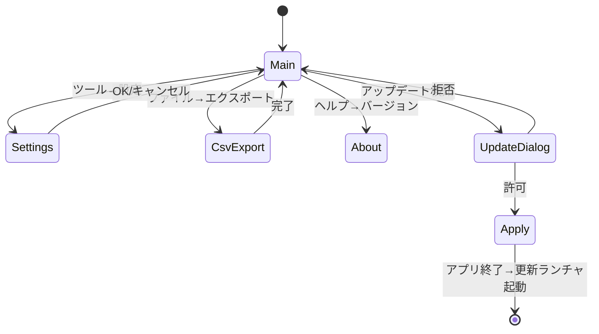

# 詳細設計書: UI設計編

| 項目 | 内容 |
|------|------|
| プロダクト名 | LivelyRec |
| 版数 | 0.1（ドラフト） |
| 作成日 | 2026-05-18 |
| 関連資料 | `05_基本設計書.md` §1, §8、`06_詳細設計_アーキテクチャ.md` §1, §4 |

> LivelyRec のデスクトップ UI（PySide6）と、配信支援ブラウザソース（HTML/JS）の構成・画面遷移・主要ウィジェット仕様を確定する。

---

## 1. 設計方針

- PySide6 6.7+ を利用。Qt Widgets ベース（QML は使用しない）。
- レイアウトは **MVVM 風**: `RecordingViewModel` が `RecordingService` のイベントを Slot で受け、UI に反映。
- 全ウィジェットは `QSettings` ではなくアプリ側の `ConfigStore` を経由した永続化（テスト容易性のため）。
- ハイDPI対応: `QApplication.setAttribute(Qt.AA_EnableHighDpiScaling)` を起動時に呼ぶ。
- 多言語化は v1.0 では日本語固定（FR-SYS-004）。

---

## 2. メインウィンドウ構成

### 2.1. レイアウト

```
┌────────────────────────────────────────────────────────────┐
│ ファイル(F)  記録(R)  ツール(T)  ヘルプ(H)            ─ □ ✕│
├────────────────────────────────────────────────────────────┤
│ ┌─ 接続パネル ────────────────────┐ ┌─ 業務日カウンタ ────┐ │
│ │ OBS: ● 接続中  ws://127.0.0.1:..│ │ 2026-05-18         │ │
│ │ [ 切断 ] [ 設定... ]            │ │ 切替: 毎日 06:00   │ │
│ │ 記録: ● 記録中                  │ │                    │ │
│ │ [ 記録停止 ]                    │ │ 総打鍵数  14,858   │ │
│ └─────────────────────────────────┘ │  COOL    12,345    │ │
│                                     │  GREAT    2,345    │ │
│ ┌─ 現在状態 ───────────────────┐    │  GOOD       123    │ │
│ │ 画面: プレイ画面             │    │  BAD         45    │ │
│ │ 楽曲: ぽぽぽかレトロード     │    └────────────────────┘ │
│ │ 難易度: HYPER (Lv.36)        │                          │
│ │ プレイ中スコア: 030210       │ ┌─ 直近リザルト ────────┐ │
│ │ コンボ: 109                  │ │ ぽぽぽかレトロード HYP│ │
│ └──────────────────────────────┘ │ Score 87268 CLEAR  AAA│ │
│                                  │ ──────────────────── │ │
│ ┌─ 配信支援URL ─────────────────┐ │ 漆黒の…   EX        │ │
│ │ ws://127.0.0.1:14514/v1       │ │ Score 92407 F.COMBO S│ │
│ │ ブラウザソース: http://…      │ └──────────────────────┘ │
│ │ [ クリップボードにコピー ]    │                          │
│ └───────────────────────────────┘                          │
├────────────────────────────────────────────────────────────┤
│ ステータスバー: ● 接続中  最終マスタ更新: 2026-05-18 12:00  │
└────────────────────────────────────────────────────────────┘
```

### 2.2. メニュー

| メニュー | 項目 | 動作 |
|----------|------|------|
| ファイル(F) | CSV エクスポート(E)... | エクスポートダイアログ |
|            | 終了(X) | アプリ終了 |
| 記録(R) | 記録開始(S) | RecordingService.start() |
|         | 記録停止(P) | RecordingService.stop() |
| ツール(T) | 設定(O)... | SettingsDialog |
|          | マスタ更新(M) | 手動マスタ取得 |
|          | アップデートを確認(U) | UpdateService.check() |
|          | ログフォルダを開く(L) | エクスプローラで開く |
| ヘルプ(H) | バージョン情報(A)... | About ダイアログ |

### 2.3. ステータスバー

- 左: 接続インジケータ（緑●=接続中、灰●=切断、赤●=失敗）
- 中央: 最終マスタ更新時刻
- 右: アプリバージョン

---

## 3. ウィジェット詳細

### 3.1. `ConnectionPanel` （接続パネル）

シグナル受信:
- `recording_service.on_state_changed` → ラベル更新
- `recording_service.on_screen_changed` → 「画面」表示

ボタン:
- 「OBS設定」→ SettingsDialog の OBS タブを開く
- 「記録開始 / 停止」→ ボタンラベルとアクションが排他

### 3.2. `RecordStatusPanel` （現在状態パネル）

```
画面: <ScreenType の日本語表記>
楽曲: <識別済み楽曲名 or "検出失敗" or "未特定">
難易度: <難易度> (Lv.<level>) or "—"
プレイ中スコア: <現在スコア> （プレイ画面のみ）
コンボ: <現在コンボ>
```

- 楽曲特定ロジックが走った結果 `song_identification_failed=True` の場合は **「検出失敗」** を表示（ブラウザソースと文言を統一）。
- まだ判定が走っていない状態（プレイ開始直後など）は「未特定」を表示。
- 検出失敗時／未特定時は楽曲行の下に小さく「OCR: <生テキスト>」を表示（デバッグ補助）。

### 3.3. `DailyCounterPanel` （業務日カウンタ）

業務日表示:
```
業務日: 2026-05-18
切替: 毎日 06:00（あと 14時間30分）
```

打鍵数表示:
```
総打鍵数  14,858
  COOL    12,345
  GREAT    2,345
  GOOD       123
  BAD         45
```

業務日切替直前（30分以内）は色を変えて警告表示。

### 3.4. `RecentResultsPanel` （直近リザルト）

`ResultRepository.list_recent(limit=10)` を購読し更新（FR-STR-009 と同一データソース）。`/browser/recent/` ブラウザソースとほぼ同じ表示内容をデスクトップ UI 上にも持たせる。

```
ぽぽぽかレトロード HYP
Score 87268 CLEAR AAA
──────────────────────
（検出失敗）  EX
Score 74321 CLEAR AA+
──────────────────────
漆黒のスペシャルプリン... EX
Score 92407 F.COMBO S+
──────────────────────
…
```

- `chart_id = NULL`（検出失敗）のセッションは楽曲名箇所に **「（検出失敗）」** と表示する。
- ダブルクリックで譜面別の履歴ダイアログを開く（v1.0スコープ外 or 任意拡張）。

### 3.5. `BroadcastUrlPanel` （配信支援URL）

ブラウザソースは v1.x で **4 種類の独立 URL** として配信される（FR-STR-007 / FR-STR-010）。本パネルでは 4 URL すべてを **コピーボタン付き** で並べて提示する。WS URI（外部連携用、I-023）は設定ダイアログ WebSocket タブへ集約済みのため本パネルには表示しない。

```
配信支援ブラウザソース URL（OBS のブラウザソースに追加してください）
  打鍵数カウンタ             http://127.0.0.1:14514/browser/keycount/              [コピー]
  現在のプレイ楽曲           http://127.0.0.1:14514/browser/now-playing/           [コピー]
  選曲中の楽曲のスコア履歴   http://127.0.0.1:14514/browser/now-playing-history/   [コピー]
  直近 10 件のプレイ履歴     http://127.0.0.1:14514/browser/recent/                [コピー]
```

`lan_publish=true` の場合は host を LAN IP（`shared/network.py` で解決）に置換した URL を表示（I-022）。`settings.json` で `token` が明示設定されている場合に限り、`?token=xxxxx` を末尾に付与する。

「選曲中の楽曲のスコア履歴」は **v1.x ではプレースホルダ実装**（FR-STR-004）であることを示すツールチップを併記する。

### 3.6. `SettingsDialog`

タブ構成:

1. **OBS タブ**:
   - ホスト、ポート、ソース名選択（GetSceneList で取得）、接続テスト
   - パスワード: 入力フィールド + 「パスワードを保存する」チェックボックス（既定 ON）
   - **常時警告表示（黄色背景の注意バー）**:
     > ⚠ 設定ファイル (`livelyrec_data/settings.json`) は **平文** で保存されます。サポート依頼でフォルダを共有する際は、必ず OBS パスワードを設定UIから削除してから送付してください。
2. **記録タブ**: fps、業務日切替時刻（00-23時のSpinBox、既定6）、**リザルト画面の自動スクリーンショット**:
   - 「リザルト画面を自動でスクリーンショット保存する」チェックボックス（既定 OFF、FR-REC-046）
   - 保存先パス（QLineEdit + 参照ボタン、既定の表示は `<livelyrec_data>/result/`、空欄なら既定にフォールバック）
   - 保存先ドライブの空き容量を表示し、500MB を下回る場合は警告色（NFR-OPS-006）
3. **WebSocket タブ**: バインドアドレス、ポート、LAN公開ON/OFF。**WS URI**（外部連携用）を表示しコピーボタン併設（I-023）。トークンは UI 表示しないが `settings.json` への直接設定は後方互換として尊重する
4. **配信支援タブ**: テーマCSS URL（任意上書き）。4 ブラウザソース URL の一覧プレビューを参考表示（コピーは `BroadcastUrlPanel` 側で実施）
5. **アップデート タブ**: 自動更新ON/OFF、起動時チェックON/OFF
6. **マスタ タブ**: 配信元URL、手動取得ボタン
7. **開発者設定セクション（折りたたみ、既定で閉）**（FR-DEV-001）:
   - 注意文: 「この機能は LivelyRec の認識精度向上のための実験的機能です。データ保存先の空き容量に注意してください」
   - 「リザルト画面のバナー画像を保存する（開発者向け）」チェックボックス（既定 OFF、FR-DEV-002）
   - 保存先パス（既定 `<livelyrec_data>/banner/`、空欄なら既定にフォールバック）
   - 保存先ドライブの空き容量表示（記録タブと同じロジック）

### 3.7. 初回起動時のパスワード入力ダイアログ

`obs.password_persist=false` 設定時、毎起動時に「OBS パスワードを入力してください」ダイアログを表示する（OK で接続継続、キャンセルで未接続状態）。

### 3.8. データフォルダ警告ダイアログ

書込み不可検知時（NFR-OPS-005）に表示するモーダル:

```
タイトル: LivelyRec - データフォルダに書き込めません

本文:
データフォルダ `<実パス>` への書き込み権限がありません。
Program Files 配下や OneDrive 同期フォルダなど、書き込み制限のある
場所にインストールされている可能性があります。

LivelyRec.exe ごとフォルダを、ドキュメントやデスクトップなどの
書き込み可能な場所に移動してから再度起動してください。

[ フォルダを開く ]   [ 終了 ]
```

---

## 4. 画面遷移（UI）



---

## 5. ViewModel と Service の接続

```python
class RecordingViewModel(QObject):
    state_text = Property(str, ...)
    screen_text = Property(str, ...)
    current_song_text = Property(str, ...)
    current_score_text = Property(str, ...)
    daily_count_total = Property(int, ...)
    ...

    def __init__(self, service: RecordingService):
        super().__init__()
        service.on_state_changed.connect(self._on_state_changed)
        service.on_screen_changed.connect(self._on_screen_changed)
        service.on_judgements_tick.connect(self._on_tick)
        service.on_result_recorded.connect(self._on_result)
        service.on_business_day_rolled.connect(self._on_rolled)

    @Slot(RecordingState)
    def _on_state_changed(self, state): ...
```

UI ウィジェットは ViewModel のシグナル/プロパティを購読するだけ。

---

## 6. 配信支援ブラウザソース（v1.x: 4 ソース独立構成）

### 6.1. 配置

```
browser_source/
├── index.html                    # 4 ソースへのリンク集（/browser/）
├── keycount/
│   ├── index.html                # /browser/keycount/
│   ├── app.js
│   └── style.css
├── now_playing/
│   ├── index.html                # /browser/now-playing/
│   ├── app.js
│   └── style.css
├── now_playing_history/
│   ├── index.html                # /browser/now-playing-history/
│   ├── app.js
│   └── style.css
└── recent/
    ├── index.html                # /browser/recent/
    ├── app.js
    └── style.css
```

- 各ソースは独立した HTML/JS/CSS で構成し、OBS のブラウザソースに個別追加する。
- WebSocket Server は静的配信を `/browser/*` にマウントし、末尾スラッシュなしアクセスは 301 リダイレクト（`08_詳細設計_API設計.md` §1.10）。
- 旧 `browser_source/index.html`（単一ページ実装）は v1.x で削除する。

### 6.2. ページ構成（共通フォーマット）

各ソースの HTML は最小構成で `data-lr="..."` 属性ベースの DOM とする（FR-STR-005）。例: `now_playing/index.html`:

```html
<!doctype html>
<html lang="ja">
<head>
  <meta charset="utf-8">
  <link rel="stylesheet" href="style.css">
  <link rel="stylesheet" id="custom-theme" href="">
</head>
<body>
  <div class="livelyrec-now-playing" data-lr="root" data-lr-source="now-playing">
    <h3 data-lr="display-title">—</h3>
    <p>
      <span data-lr="difficulty">—</span>
      <span data-lr="level">—</span>
    </p>
    <p data-lr="genre">—</p>
  </div>
  <script src="app.js"></script>
</body>
</html>
```

楽曲名検出失敗時は `[data-lr="display-title"]` に **「検出失敗」** が反映される（FR-STR-008）。CSS で `[data-lr-detection="failed"]` セレクタが効くよう、`app.js` が body に `data-lr-detection` 属性を切り替える。

### 6.3. 各ソースの DOM 構造（要点）

| ソース | 主な data-lr 属性 |
|--------|-------------------|
| keycount | `counter`, `cool`, `great`, `good`, `bad`, `total`, `graph` |
| now-playing | `display-title`, `difficulty`, `level`, `genre`, `data-lr-detection`（attribute, "ok" or "failed"） |
| now-playing-history | `display-title`, `history-list`, `history-row`, `recorded-at`, `score`, `rank` |
| recent | `recent-list`, `recent-row`, `started-at`, `display-title`, `difficulty`, `score`, `clear-type`, `rank` |

### 6.4. JavaScript ロジック

各ソースの `app.js` は **共通の最小フレームワーク**（`browser_source/common.js`）を読み込んだうえで、ソース固有のメッセージハンドラを実装する。共通機能:

- WebSocket 接続管理（指数バックオフ再接続）
- 共通メッセージ受信（`state.changed`）
- テーマ CSS 上書き（`?theme=<URL>`）

```javascript
// browser_source/common.js（共通）
export function connect({ onMessage }) {
  const params = new URLSearchParams(location.search);
  const url = params.get('ws') || `ws://${location.host}/v1`;
  const token = params.get('token');
  function open() {
    const ws = new WebSocket(token ? `${url}?token=${token}` : url);
    ws.onmessage = ev => onMessage(JSON.parse(ev.data), ws);
    ws.onclose = () => setTimeout(open, Math.min(1000 * 2 ** retry++, 30000));
    ws.onerror = e => console.error(e);
  }
  let retry = 0;
  open();
}
```

ソース別ハンドラ例（`now_playing/app.js`）:

```javascript
import { connect } from '../common.js';
const titleEl = document.querySelector('[data-lr="display-title"]');
const rootEl = document.querySelector('[data-lr="root"]');
connect({
  onMessage: (msg, ws) => {
    if (msg.type === 'now_playing.changed' || msg.type === 'result.recorded') {
      const p = msg.payload;
      titleEl.textContent = p.display_title;   // 検出失敗時は "検出失敗"
      rootEl.dataset.lrDetection = p.identified === false || p.chart == null ? 'failed' : 'ok';
    }
  }
});
```

### 6.5. テーマカスタマイズ

ユーザは `?theme=<URL>` クエリで `#custom-theme` の href を上書き可能（全ソース共通）。設定 UI の「テーマCSS URL」もこれと連動。

### 6.6. 表示要素の仕様

#### 6.6.1. `/browser/keycount/`

- 各判定数（COOL/GREAT/GOOD/BAD/TOTAL）は カンマ区切り。増加時に短い CSS transition。
- 桁あふれ対策: 7 桁を超える場合は `k` / `M` 略表記。
- 時系列グラフ: 直近 10 分の打鍵レート（毎秒）を折れ線（HTML5 Canvas）。過去データはクライアント側集計（サーバから送らない）。

#### 6.6.2. `/browser/now-playing/`

- `now_playing.changed` / `result.recorded` を受信して `display_title` を更新。
- 検出失敗時は `display-title` に **「検出失敗」** を表示し、`data-lr-detection="failed"` を付与（CSS で色変えが可能）。
- 楽曲特定済みの場合は難易度・レベル・ジャンルを併記。

#### 6.6.3. `/browser/now-playing-history/`

- 接続時にスナップショット `now_playing.changed` を受信 → `chart_id` を取得 → `chart.history.request(limit=N)` を送信。
- `chart.history.response` で日付・スコア・ランク・クリア種類を表で表示。
- `chart_id = null`（検出失敗）の場合は履歴を空とし、`display-title` に「検出失敗」を表示。

#### 6.6.4. `/browser/recent/`

- 接続時に `recent.history.request(limit=10)` を送信し初期一覧を表示。
- 以後 `result.recorded` を受信するたびに先頭に追加・末尾を切り捨てて常時 10 件表示。
- 検出失敗エントリは `display_title="検出失敗"`、`data-lr-detection="failed"` を付与して描画。

---

## 7. ハイDPI/スケーリング対応

- Qt: `Qt.AA_EnableHighDpiScaling` + `Qt.AA_UseHighDpiPixmaps`。
- アイコンは SVG（または各倍率の PNG）。
- ブラウザソース側: OBS のスケーリングに従う。

---

## 8. アクセシビリティ

- ボタンには Mnemonic（`&記録開始(&S)`）を設定。
- 重要操作はキーボードショートカット併用:
  - Ctrl+S: 記録開始
  - Ctrl+P: 記録停止
  - Ctrl+E: CSV エクスポート
  - F1: ヘルプ

---

## 9. テーマ・スタイル

- ライト/ダークテーマは Qt の Fusion スタイル + パレット切替で実装。設定で選択可。
- 配信支援ブラウザソースはユーザの好みでカスタマイズしてもらう前提のため、既定テーマは半透明背景の控えめなデザイン。

---

## 10. エラー UI

| 種別 | 表示方法 |
|------|----------|
| OBS 認証失敗 | モーダル「OBS のパスワードが一致しません」+ 設定タブへの導線 |
| OBS 接続失敗（ネットワーク） | ステータスバー赤●＋トースト通知 |
| マスタ取得失敗 | ステータスバーに警告アイコン（クリックで詳細） |
| クラッシュ | グローバルexcepthook → モーダルで「エラーレポートを保存しました。再起動してください」 |
| アップデート失敗 | 静かに無視（FR-UPD-004）。次回試行 |

---

## 11. 詳細設計の他編との関係

- ViewModel が呼ぶ Service: `06_詳細設計_アーキテクチャ.md` §3.3
- WebSocket メッセージ: `08_詳細設計_API設計.md` §1
- 過去リザルト取得: `07_詳細設計_DB設計.md` §4

---

## 12. 承認

| 役割 | 氏名 | 日付 | 結果 |
|------|------|------|------|
| プロダクトオーナー | （ユーザ） | YYYY-MM-DD | 承認／差戻し |

---

## 改訂履歴

| 版 | 日付 | 内容 | 改訂者 |
|----|------|------|--------|
| 0.1 | 2026-05-18 | 初版作成 | Claude Code |
| 0.2 | 2026-05-18 | ポータブル構成方針に伴い 設定UIに警告バー追加、毎起動入力ダイアログ、書込不可ダイアログを追加 | Claude Code |
| 0.3 | 2026-05-27 | v1.x 機能追加: BroadcastUrlPanel を 4 URL 構成に書換、SettingsDialog 記録タブに自動スクショ設定、開発者設定セクション（折りたたみ）を追加、配信支援ブラウザソースを 4 ソース独立構成に再定義、RecordStatusPanel / RecentResultsPanel に「検出失敗」表示を追加 | Claude Code |
