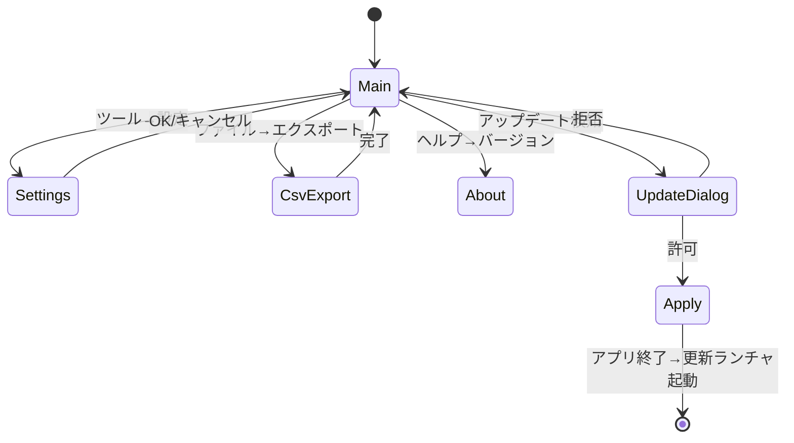

# 詳細設計書: UI設計編

| 項目 | 内容 |
|------|------|
| プロダクト名 | LivelyRec |
| 版数 | 0.1（ドラフト） |
| 作成日 | 2026-05-18 |
| 関連資料 | `05_基本設計書.md` §1, §8、`06_詳細設計_アーキテクチャ.md` §1, §4 |

> LivelyRec のデスクトップ UI（PySide6）と、配信支援ブラウザソース（HTML/JS）の構成・画面遷移・主要ウィジェット仕様を確定する。

---

## 1. 設計方針

- PySide6 6.7+ を利用。Qt Widgets ベース（QML は使用しない）。
- レイアウトは **MVVM 風**: `RecordingViewModel` が `RecordingService` のイベントを Slot で受け、UI に反映。
- 全ウィジェットは `QSettings` ではなくアプリ側の `ConfigStore` を経由した永続化（テスト容易性のため）。
- ハイDPI対応: `QApplication.setAttribute(Qt.AA_EnableHighDpiScaling)` を起動時に呼ぶ。
- 多言語化は v1.0 では日本語固定（FR-SYS-004）。

---

## 2. メインウィンドウ構成

### 2.1. レイアウト

```
┌────────────────────────────────────────────────────────────┐
│ ファイル(F)  記録(R)  ツール(T)  ヘルプ(H)            ─ □ ✕│
├────────────────────────────────────────────────────────────┤
│ ┌─ 接続パネル ────────────────────┐ ┌─ 業務日カウンタ ────┐ │
│ │ OBS: ● 接続中  ws://127.0.0.1:..│ │ 2026-05-18         │ │
│ │ [ 切断 ] [ 設定... ]            │ │ 切替: 毎日 06:00   │ │
│ │ 記録: ● 記録中                  │ │                    │ │
│ │ [ 記録停止 ]                    │ │ 総打鍵数  14,858   │ │
│ └─────────────────────────────────┘ │  COOL    12,345    │ │
│                                     │  GREAT    2,345    │ │
│ ┌─ 現在状態 ───────────────────┐    │  GOOD       123    │ │
│ │ 画面: プレイ画面             │    │  BAD         45    │ │
│ │ 楽曲: ぽぽぽかレトロード     │    └────────────────────┘ │
│ │ 難易度: HYPER (Lv.36)        │                          │
│ │ プレイ中スコア: 030210       │ ┌─ 直近リザルト ────────┐ │
│ │ コンボ: 109                  │ │ ぽぽぽかレトロード HYP│ │
│ └──────────────────────────────┘ │ Score 87268 CLEAR  AAA│ │
│                                  │ ──────────────────── │ │
│ ┌─ 配信支援URL ─────────────────┐ │ 漆黒の…   EX        │ │
│ │ ws://127.0.0.1:14514/v1       │ │ Score 92407 F.COMBO S│ │
│ │ ブラウザソース: http://…      │ └──────────────────────┘ │
│ │ [ クリップボードにコピー ]    │                          │
│ └───────────────────────────────┘                          │
├────────────────────────────────────────────────────────────┤
│ ステータスバー: ● 接続中  最終マスタ更新: 2026-05-18 12:00  │
└────────────────────────────────────────────────────────────┘
```

### 2.2. メニュー

| メニュー | 項目 | 動作 |
|----------|------|------|
| ファイル(F) | CSV エクスポート(E)... | エクスポートダイアログ |
|            | 終了(X) | アプリ終了 |
| 記録(R) | 記録開始(S) | RecordingService.start() |
|         | 記録停止(P) | RecordingService.stop() |
| ツール(T) | 設定(O)... | SettingsDialog |
|          | マスタ更新(M) | 手動マスタ取得 |
|          | アップデートを確認(U) | UpdateService.check() |
|          | ログフォルダを開く(L) | エクスプローラで開く |
| ヘルプ(H) | バージョン情報(A)... | About ダイアログ |

### 2.3. ステータスバー

- 左: 接続インジケータ（緑●=接続中、灰●=切断、赤●=失敗）
- 中央: 最終マスタ更新時刻
- 右: アプリバージョン

---

## 3. ウィジェット詳細

### 3.1. `ConnectionPanel` （接続パネル）

シグナル受信:
- `recording_service.on_state_changed` → ラベル更新
- `recording_service.on_screen_changed` → 「画面」表示

ボタン:
- 「OBS設定」→ SettingsDialog の OBS タブを開く
- 「記録開始 / 停止」→ ボタンラベルとアクションが排他

### 3.2. `RecordStatusPanel` （現在状態パネル）

```
画面: <ScreenType の日本語表記>
楽曲: <識別済み楽曲名 or "未特定">
難易度: <難易度> (Lv.<level>) or "—"
プレイ中スコア: <現在スコア> （プレイ画面のみ）
コンボ: <現在コンボ>
```

未特定時は楽曲行に小さく「OCR: <生テキスト>」を表示（デバッグ補助）。

### 3.3. `DailyCounterPanel` （業務日カウンタ）

業務日表示:
```
業務日: 2026-05-18
切替: 毎日 06:00（あと 14時間30分）
```

打鍵数表示:
```
総打鍵数  14,858
  COOL    12,345
  GREAT    2,345
  GOOD       123
  BAD         45
```

業務日切替直前（30分以内）は色を変えて警告表示。

### 3.4. `RecentResultsPanel` （直近リザルト）

`ResultRepository.list_recent(limit=10)` を購読し更新。

```
ぽぽぽかレトロード HYP
Score 87268 CLEAR AAA
──────────────────────
漆黒のスペシャルプリン... EX
Score 92407 F.COMBO S+
──────────────────────
…
```

ダブルクリックで譜面別の履歴ダイアログを開く（v1.0スコープ外 or 任意拡張）。

### 3.5. `BroadcastUrlPanel` （配信支援URL）

```
ws://127.0.0.1:14514/v1                 [コピー]
ブラウザソース: <絶対パス>/index.html   [コピー]
ブラウザソース: http://127.0.0.1:14514/browser  [コピー]
```

LAN公開時はトークンを含めた URL を表示:
```
ws://192.168.1.100:14514/v1?token=xxxxx  [コピー]
```

### 3.6. `SettingsDialog`

タブ構成:

1. **OBS タブ**:
   - ホスト、ポート、ソース名選択（GetSceneList で取得）、接続テスト
   - パスワード: 入力フィールド + 「パスワードを保存する」チェックボックス（既定 ON）
   - **常時警告表示（黄色背景の注意バー）**:
     > ⚠ 設定ファイル (`livelyrec_data/settings.json`) は **平文** で保存されます。サポート依頼でフォルダを共有する際は、必ず OBS パスワードを設定UIから削除してから送付してください。
2. **記録タブ**: fps、業務日切替時刻（00-23時のSpinBox、既定6）
3. **WebSocket タブ**: バインドアドレス、ポート、LAN公開ON/OFF、トークン表示・再生成（**LAN公開時のみ警告**: 「トークンも平文保存です。共有時は削除してください」）
4. **配信支援タブ**: テーマCSS URL（任意上書き）
5. **アップデート タブ**: 自動更新ON/OFF、起動時チェックON/OFF
6. **マスタ タブ**: 配信元URL、手動取得ボタン

### 3.7. 初回起動時のパスワード入力ダイアログ

`obs.password_persist=false` 設定時、毎起動時に「OBS パスワードを入力してください」ダイアログを表示する（OK で接続継続、キャンセルで未接続状態）。

### 3.8. データフォルダ警告ダイアログ

書込み不可検知時（NFR-OPS-005）に表示するモーダル:

```
タイトル: LivelyRec - データフォルダに書き込めません

本文:
データフォルダ `<実パス>` への書き込み権限がありません。
Program Files 配下や OneDrive 同期フォルダなど、書き込み制限のある
場所にインストールされている可能性があります。

LivelyRec.exe ごとフォルダを、ドキュメントやデスクトップなどの
書き込み可能な場所に移動してから再度起動してください。

[ フォルダを開く ]   [ 終了 ]
```

---

## 4. 画面遷移（UI）



---

## 5. ViewModel と Service の接続

```python
class RecordingViewModel(QObject):
    state_text = Property(str, ...)
    screen_text = Property(str, ...)
    current_song_text = Property(str, ...)
    current_score_text = Property(str, ...)
    daily_count_total = Property(int, ...)
    ...

    def __init__(self, service: RecordingService):
        super().__init__()
        service.on_state_changed.connect(self._on_state_changed)
        service.on_screen_changed.connect(self._on_screen_changed)
        service.on_judgements_tick.connect(self._on_tick)
        service.on_result_recorded.connect(self._on_result)
        service.on_business_day_rolled.connect(self._on_rolled)

    @Slot(RecordingState)
    def _on_state_changed(self, state): ...
```

UI ウィジェットは ViewModel のシグナル/プロパティを購読するだけ。

---

## 6. 配信支援ブラウザソース

### 6.1. 配置

- `browser_source/index.html` （単一ファイル + 同階層に `app.js`, `style.css`）
- パッケージング時にアプリと同梱。
- ユーザは OBS のブラウザソースで `file://<path>/index.html` または `http://localhost:14514/browser` を指定。

LivelyRec の Web サーバは WebSocket Server に **静的ファイル配信機能** を簡易併設（`browser_source/` を `/browser/*` でマウント）。

### 6.2. ページ構成

```html
<!doctype html>
<html lang="ja">
<head>
  <meta charset="utf-8">
  <link rel="stylesheet" href="style.css">
  <link rel="stylesheet" id="custom-theme" href="">
</head>
<body>
  <div class="livelyrec-overlay" data-lr="root">
    <section class="livelyrec-counter" data-lr="counter">
      <div class="livelyrec-counter-row" data-lr="cool"><span class="lbl">COOL</span><span class="val">0</span></div>
      <div class="livelyrec-counter-row" data-lr="great">...</div>
      <div class="livelyrec-counter-row" data-lr="good">...</div>
      <div class="livelyrec-counter-row" data-lr="bad">...</div>
      <div class="livelyrec-counter-row" data-lr="total">...</div>
    </section>
    <section class="livelyrec-history" data-lr="history">
      <h3 data-lr="song-title">楽曲名</h3>
      <table>
        <tr><th>Best</th><td data-lr="best">—</td></tr>
        <tr><th>Latest</th><td data-lr="latest">—</td></tr>
      </table>
    </section>
    <section class="livelyrec-graph" data-lr="graph">
      <canvas id="keycount-chart" width="600" height="180"></canvas>
    </section>
  </div>
  <script src="app.js"></script>
</body>
</html>
```

要素には `data-lr="..."` 属性とクラス名を付与。ユーザは独自 CSS で見た目を完全に上書き可能（FR-STR-005）。

### 6.3. JavaScript ロジック

`app.js` は単一ファイルで以下を実装:

- WebSocket 接続管理（指数バックオフ再接続）
- メッセージハンドラ（`state.changed`, `judgements.tick`, `chart.selected`, etc.）
- 打鍵カウンタの DOM 更新
- 楽曲履歴のリクエスト送信（`chart.selected` 受信時に `chart.history.request` を送信）
- 時系列グラフ描画（HTML5 Canvas、外部依存なし）

```javascript
const url = (new URLSearchParams(location.search)).get('ws') || 'ws://127.0.0.1:14514/v1';
const token = (new URLSearchParams(location.search)).get('token');

function connect() {
  const opts = token ? { headers: { Authorization: `Bearer ${token}` } } : {};
  const ws = new WebSocket(url);
  ws.onmessage = handleMessage;
  ws.onclose = () => setTimeout(connect, 1000); // 指数バックオフは省略表示
  ws.onerror = e => console.error(e);
}
```

### 6.4. テーマカスタマイズ

ユーザは `?theme=<URL>` クエリで `#custom-theme` の href を上書き可能。設定 UI の「テーマCSS URL」もこれと連動。

### 6.5. 表示要素の仕様

#### 6.5.1. 打鍵カウンタ

各判定行:
- 数値はカンマ区切り。
- 増加時に短いアニメーション（CSS transition で1ステップ）。
- 数値が大きい場合の桁あふれ対策: 7桁まで表示、それ以上は `k` / `M` 略表記（多くないと思うが念のため）。

#### 6.5.2. 時系列グラフ

- 直近10分の打鍵レート（毎秒の打鍵数）を折れ線で表示。
- 縦軸は自動スケール、横軸は時刻ラベル。
- 過去データはクライアント側で `judgements.tick` を集計して保持（サーバから送らない）。

#### 6.5.3. 過去リザルト

- `chart.selected` 受信時に表示譜面を更新。
- `chart.history.response` を受け取ったら Best / Latest を表示。
- 識別できていない場合は「楽曲未特定」を表示。

---

## 7. ハイDPI/スケーリング対応

- Qt: `Qt.AA_EnableHighDpiScaling` + `Qt.AA_UseHighDpiPixmaps`。
- アイコンは SVG（または各倍率の PNG）。
- ブラウザソース側: OBS のスケーリングに従う。

---

## 8. アクセシビリティ

- ボタンには Mnemonic（`&記録開始(&S)`）を設定。
- 重要操作はキーボードショートカット併用:
  - Ctrl+S: 記録開始
  - Ctrl+P: 記録停止
  - Ctrl+E: CSV エクスポート
  - F1: ヘルプ

---

## 9. テーマ・スタイル

- ライト/ダークテーマは Qt の Fusion スタイル + パレット切替で実装。設定で選択可。
- 配信支援ブラウザソースはユーザの好みでカスタマイズしてもらう前提のため、既定テーマは半透明背景の控えめなデザイン。

---

## 10. エラー UI

| 種別 | 表示方法 |
|------|----------|
| OBS 認証失敗 | モーダル「OBS のパスワードが一致しません」+ 設定タブへの導線 |
| OBS 接続失敗（ネットワーク） | ステータスバー赤●＋トースト通知 |
| マスタ取得失敗 | ステータスバーに警告アイコン（クリックで詳細） |
| クラッシュ | グローバルexcepthook → モーダルで「エラーレポートを保存しました。再起動してください」 |
| アップデート失敗 | 静かに無視（FR-UPD-004）。次回試行 |

---

## 11. 詳細設計の他編との関係

- ViewModel が呼ぶ Service: `06_詳細設計_アーキテクチャ.md` §3.3
- WebSocket メッセージ: `08_詳細設計_API設計.md` §1
- 過去リザルト取得: `07_詳細設計_DB設計.md` §4

---

## 12. 承認

| 役割 | 氏名 | 日付 | 結果 |
|------|------|------|------|
| プロダクトオーナー | （ユーザ） | YYYY-MM-DD | 承認／差戻し |

---

## 改訂履歴

| 版 | 日付 | 内容 | 改訂者 |
|----|------|------|--------|
| 0.1 | 2026-05-18 | 初版作成 | Claude Code |
| 0.2 | 2026-05-18 | ポータブル構成方針に伴い 設定UIに警告バー追加、毎起動入力ダイアログ、書込不可ダイアログを追加 | Claude Code |
