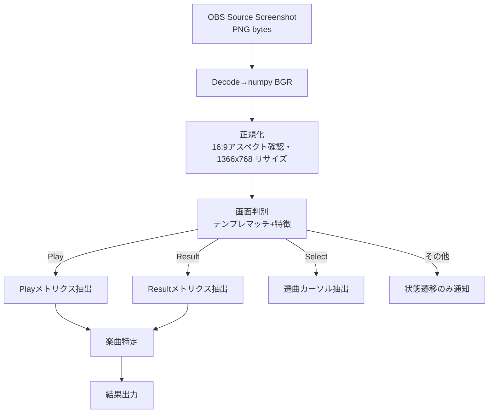

# 詳細設計書: 画像認識編

| 項目 | 内容 |
|------|------|
| プロダクト名 | LivelyRec |
| 版数 | 0.1（ドラフト） |
| 作成日 | 2026-05-18 |
| 関連資料 | `05_基本設計書.md` §3,§4、PoC #01-#03 |

> 画像認識パイプラインの詳細：解像度正規化、ROI 座標確定、各画面の判別ロジック、楽曲特定、リトライ検出、クリアメダル・ランク算出までを実装着手可能なレベルで仕様化する。

---

## 1. パイプライン全体図



---

## 2. 正規化処理

### 2.1. 入力

- OBS `GetSourceScreenshot` で取得した PNG バイト列
- 通常 1366×768 だが、ユーザの OBS シーン設定で異なる場合あり

### 2.2. ステップ

1. PNG → numpy BGR デコード
2. アスペクト比チェック: 16:9 ±2% の許容範囲外なら **警告ログ** + 処理は継続（黒帯トリミング試行）
3. 必要に応じて黒帯トリミング:
   - 上下左右 50px 領域の輝度平均 < 10 ならその辺の黒帯と判定
   - 検出した黒帯を crop
4. 1366×768 に `cv2.resize` で正規化（線形補間）

### 2.3. 出力

- 1366×768 の numpy BGR 配列
- メタ情報: `{original_size, aspect_ratio, trimmed_borders}`

```python
@dataclass
class NormalizedFrame:
    image_bgr: np.ndarray   # (768, 1366, 3)
    original_size: tuple[int, int]
    aspect_ratio: float
    trimmed_borders: tuple[int, int, int, int]   # top, bottom, left, right
```

---

## 3. 画面判別

### 3.1. 判別キャッシュ

各画面の判別用テンプレート画像（`infrastructure/recognizer/templates/screens/`）と特徴:

| ID | 画面 | 判別方法 | 信頼度閾値 |
|----|------|----------|------------|
| LOAD_TO_PLAY | プレイ画面前ロード | 「Let's enjoy music!」のテンプレマッチ | 0.7 |
| LOAD_TO_READY | 準備画面前ロード | 9タイルロゴ全体のテンプレマッチ | 0.6 |
| PLAY | プレイ画面 | 上部の黒帯（y=0-40, x=400-1000）の平均輝度 < 50 かつ下部にスコアフレームを示す矩形がある | — |
| PLAY_READY | Are you ready? | プレイ画面と判定済みの上で「Are you ready?」テンプレマッチ | 0.7 |
| RESULT | リザルト画面 | 中央左下に「SCORE / COOL / GREAT / GOOD / BAD / COMBO」ラベル群を OCR で検出 | 4語以上の一致 |
| OPTION | オプション画面 | 縦長リストの「HI-SPEED ×」テキスト 5 個以上検出 | OCR |
| READY | 準備画面 | 「Option Select」見出し or 中央のバナー枠 | 0.6 |
| SELECT | 選曲画面 | 右上「Music Select」ロゴ + 左の楽曲リスト構造 | 0.6 |

### 3.2. 判別順序

優先度高い順に判定し、最初にマッチしたものを採用。

```python
def detect_screen(frame: np.ndarray) -> ScreenType:
    for kind in DETECT_ORDER:   # LOAD_TO_PLAY, LOAD_TO_READY, PLAY, RESULT, OPTION, READY, SELECT
        recognizer = recognizers[kind]
        score = recognizer.score(frame)
        if score >= recognizer.threshold:
            return kind
    return ScreenType.UNKNOWN
```

### 3.3. 状態遷移バリデーション

`StateMachine` で許可された遷移かを検証。許可外遷移は **3 連続フレーム** で観測した場合のみ受容。

```python
class StateMachine:
    _CONSECUTIVE_REQUIRED_INVALID = 3
    def transition(self, to: ScreenType) -> bool:
        if self._allowed(self._current, to):
            self._current = to
            self._invalid_count = 0
            return True
        # 不正遷移
        if to == self._pending_invalid:
            self._invalid_count += 1
            if self._invalid_count >= self._CONSECUTIVE_REQUIRED_INVALID:
                self._current = to   # 強制遷移
                self._invalid_count = 0
                return True
        else:
            self._pending_invalid = to
            self._invalid_count = 1
        return False
```

---

## 4. ROI 座標（1366×768基準）

すべて `infrastructure/recognizer/roi_defs.py` に集約。

### 4.1. プレイ画面 ROI

```python
PLAY_ROI = {
    "song_name":    (350, 0, 980, 65),
    "genre":        (350, 60, 980, 90),
    "score":        (110, 590, 410, 665),
    "combo":        (60, 700, 220, 760),
    "speed":        (1140, 595, 1340, 660),
    # 判定累計（プレイ中表示はゲーム本体側で常時表示されない部分あり、必要に応じて）
}
```

### 4.2. リザルト画面 ROI

```python
RESULT_ROI = {
    "clear_label": (90, 30, 760, 200),    # Stage Clear / Failed / FULL COMBO / PERFECT
    "score":       (680, 415, 880, 470),
    "cool":        (740, 472, 880, 510),
    "great":       (740, 500, 880, 538),
    "good":        (740, 528, 880, 565),
    "bad":         (740, 558, 880, 595),
    "combo":       (740, 600, 880, 640),
    "best_score":  (740, 640, 880, 680),
    "best_diff":   (740, 670, 880, 705),
}
```

### 4.3. 選曲画面 ROI

```python
SELECT_ROI = {
    "music_select_logo": (1150, 0, 1366, 60),
    "list_cursor":        (50, 100, 750, 720),  # 楽曲リスト全体（カーソル位置を別途検出）
    "cursor_difficulty":  (60, 380, 105, 410),
}
```

選曲画面のカーソル特定は「中央付近の楽曲行ハイライト」のテンプレマッチで検出する。

### 4.4. 準備画面 ROI

```python
READY_ROI = {
    "option_select_label": (380, 50, 980, 120),
    "song_banner":         (560, 130, 980, 220),
    "difficulty_label":    (560, 220, 660, 260),
}
```

---

## 5. メトリクス抽出

### 5.1. プレイ画面

#### 5.1.1. 楽曲名（black-bg / white-text バー）

```python
def extract_song_name(frame: np.ndarray, ocr: OcrEngine) -> tuple[str, float]:
    roi = crop(frame, PLAY_ROI["song_name"])
    # 黒帯マスクで白文字以外を黒化
    hsv = cv2.cvtColor(roi, cv2.COLOR_BGR2HSV)
    mask = cv2.inRange(hsv, (0, 0, 200), (180, 50, 255))   # 白色のみ
    bw = cv2.bitwise_and(roi, roi, mask=mask)
    text = ocr.recognize_text(bw)
    return text, ocr.last_confidence()
```

#### 5.1.2. スコア・コンボ

```python
def extract_play_score(frame: np.ndarray, ocr: OcrEngine) -> int | None:
    roi = crop(frame, PLAY_ROI["score"])
    text = ocr.recognize_text(roi)
    digits = _digits_only(text)
    return int(digits) if digits else None
```

`_digits_only` は全角→半角変換 + 「Ｓ→5」「Ｂ→8」「Ｏ→0」等の補正を含む（PoC #02 で確認済み）。

#### 5.1.3. 連続フレームでのリトライ検出

```python
@dataclass
class PlayFrameMetrics:
    score: int | None
    cool: int | None
    great: int | None
    good: int | None
    bad: int | None
    combo: int | None

class RetryDetector:
    def __init__(self, window: int = 5) -> None:
        self._buf: deque[PlayFrameMetrics] = deque(maxlen=window)

    def push(self, m: PlayFrameMetrics) -> bool:
        if self._buf:
            prev = self._buf[-1]
            if self._is_retry(prev, m):
                self._buf.clear()
                return True
        self._buf.append(m)
        return False

    def _is_retry(self, prev: PlayFrameMetrics, cur: PlayFrameMetrics) -> bool:
        if not (prev.score and prev.combo and (prev.cool or prev.great or prev.good or prev.bad)):
            return False
        return (
            cur.combo == 0 and
            (cur.cool or 0) == 0 and (cur.great or 0) == 0 and
            (cur.good or 0) == 0 and (cur.bad or 0) == 0
        )
```

ロード画面挟みでも検知可能なよう、`push` 側で ScreenType.PLAY 以外のフレームはスキップする。

### 5.2. リザルト画面

#### 5.2.1. クリア種類

`clear_label` ROI に対して:

1. 色マスクで「紫紺色（Stage Clear）」「赤系（Failed）」「金（PERFECT/FULL COMBO）」を検出
2. テンプレートマッチで `STAGE_CLEAR`, `FAILED`, `FULL_COMBO`, `PERFECT` の4種を分類
3. 一致テンプレートを `clear_type` として返す

#### 5.2.2. スコア・コンボ・BEST

`PaddleOcrEngine.recognize_text(roi)` の結果を `_digits_only` で抽出（PoC #02 で実証済み）。

#### 5.2.3. 判定数（COOL/GREAT/GOOD/BAD）— テンプレートマッチング

PoC #03 の結論に基づき、**数字テンプレートマッチング** を採用。

```python
class DigitTemplateRecognizer:
    def __init__(self, templates: dict[int, np.ndarray]) -> None:
        """templates: {0: img0, 1: img1, ..., 9: img9}（グレースケール、サイズ統一）"""
        self._tpls = templates

    def recognize(self, roi_bgr: np.ndarray, color_hsv_range: tuple[int, int]) -> tuple[str, float]:
        # 1. 色マスク
        mask = self._color_mask(roi_bgr, color_hsv_range)
        # 2. 連結成分分割（数字候補）
        n_labels, labels, stats, _ = cv2.connectedComponentsWithStats(mask, connectivity=8)
        digit_boxes = self._filter_digit_components(stats)
        # 3. 各候補とテンプレを比較
        recognized = []
        for box in sorted(digit_boxes, key=lambda b: b.x):  # 左から右へ
            patch = self._extract_patch(mask, box)
            best_digit, best_score = self._best_match(patch)
            if best_score >= 0.7:
                recognized.append(str(best_digit))
        return "".join(recognized), min((self._tpls_scores), default=0.0)

    def _best_match(self, patch: np.ndarray) -> tuple[int, float]:
        best_d, best_s = -1, -1.0
        for d, tpl in self._tpls.items():
            resized = cv2.resize(patch, (tpl.shape[1], tpl.shape[0]))
            score = float(cv2.matchTemplate(resized, tpl, cv2.TM_CCOEFF_NORMED).max())
            if score > best_s:
                best_d, best_s = d, score
        return best_d, best_s
```

#### 5.2.4. テンプレート画像の生成

`scripts/build_digit_templates.py` を用意:

1. ユーザがサンプル画像セット（リザルト画面 N 枚）を指定
2. 各判定 ROI から色マスクで数字を抽出
3. 連結成分ごとに切り出し、ファイル名にラベル候補（手動確認用）を付けて保存
4. ユーザが目視で正しいラベルに振り分け（フォルダ `0/`, `1/`, ..., `9/`）
5. 同フォルダ内の画像を平均化して代表テンプレを生成

実装フェーズで上記スクリプトを完成させる。テンプレ画像は `livelyrec/infrastructure/recognizer/templates/digits/{resolution}/{0..9}.png` に格納。

---

## 6. 楽曲特定

### 6.1. アルゴリズム

```python
def identify_chart(
    raw_text: str,
    genre_text: str | None,
    difficulty_hint: str | None,   # OCR でとれた難易度ラベル候補（あれば）
    master: MasterRepository,
    cache: ChartCache,
    threshold: float = 65.0,
) -> tuple[Chart | None, float]:
    # キャッシュヒット（連続フレームで同じ楽曲を見ているケース）
    if cache.recent_match_for(raw_text):
        return cache.recent, 100.0

    normalized = normalize_song_title(raw_text)
    candidates = master.fuzzy_search(normalized, scorer="WRatio", limit=5)
    boosted = []
    for c, score in candidates:
        score_b = score
        if genre_text and c.song.genre and genre_text in c.song.genre:
            score_b += 5
        if difficulty_hint and c.difficulty == difficulty_hint:
            score_b += 3
        boosted.append((c, score_b))
    if not boosted:
        return None, 0.0
    boosted.sort(key=lambda t: -t[1])
    top, top_s = boosted[0]
    if top_s < threshold:
        return None, top_s
    # 2位との差が小さい場合は未特定（誤マッチ抑制）
    if len(boosted) > 1 and top_s - boosted[1][1] < 3.0:
        return None, top_s
    cache.put(raw_text, top)
    return top, top_s
```

### 6.2. 正規化関数

```python
def normalize_song_title(s: str) -> str:
    # 全角→半角、ひらがな化、記号除去、空白除去、長音正規化
    s = unicodedata.normalize("NFKC", s)
    s = jaconv.kata2hira(s)
    s = re.sub(r"[\s　]+", "", s)
    s = re.sub(r"[!?！？…・♥♡]", "", s)
    s = s.lower()
    return s
```

### 6.3. 多数決による安定化

連続フレームの楽曲特定結果を `Counter` に積み、5フレーム以上で最頻値が過半数を占めたら確定。

```python
class SongStabilizer:
    def __init__(self, window: int = 7, min_majority: float = 0.5) -> None: ...
    def push(self, chart: Chart | None) -> Chart | None: ...
```

---

## 7. クリアメダル・クリアランク算出

### 7.1. クリアランク

スコアによる固定マッピング（asagaolabo Wiki 4795 を参考に確定）:

```python
def clear_rank(score: int) -> str:
    rules = [
        (95000, "S+"),
        (90000, "S"),
        (85000, "AAA"),
        (80000, "AA+"),
        (75000, "AA"),
        (70000, "A+"),
        (65000, "A"),
        (60000, "B+"),
        (55000, "B"),
        (50000, "C+"),
        (45000, "C"),
        (40000, "D"),
    ]
    for threshold, rank in rules:
        if score >= threshold:
            return rank
    return "E"
```

> 実装前にWiki原典で最新の閾値を再確認する。

### 7.2. クリアメダル

asagaolabo Wiki 932 を参考。仕様の概要（実装前に原典で精査）:

- **PERFECT**（BAD=0 かつ COOL=満点の譜面）: メダルの最高ランク（譜面難易度別の星種）
- **FULL COMBO**（BAD=0、コンボ=満点）: ダイヤモンド系
- **CLEAR**: 丸メダル
- **FAILED**: なし

```python
def clear_medal(
    clear_type: str,
    judgements: Judgements,
    chart_difficulty: str,
) -> str:
    if clear_type == "FAILED":
        return "NONE"
    if clear_type == "PERFECT":
        return _star_medal_by_difficulty(chart_difficulty)
    if clear_type == "FULL_COMBO":
        return _diamond_medal_by_difficulty(chart_difficulty)
    return "CIRCLE"

def _star_medal_by_difficulty(d: str) -> str:
    return {"EX": "STAR_GOLD", "UPPER": "STAR_GOLD",
            "HYPER": "STAR_SILVER",
            "NORMAL": "STAR_BRONZE", "EASY": "STAR_BRONZE"}.get(d, "STAR_BRONZE")

def _diamond_medal_by_difficulty(d: str) -> str:
    return {"EX": "DIAMOND_GOLD", "UPPER": "DIAMOND_GOLD",
            "HYPER": "DIAMOND_SILVER",
            "NORMAL": "DIAMOND_BRONZE", "EASY": "DIAMOND_BRONZE"}.get(d, "DIAMOND_BRONZE")
```

> 上記マッピングは仮値。Wiki 原典の最新仕様で実装時に確定する。

---

## 8. パフォーマンス目標と内訳

実装時の想定処理時間（1366×768、CPU 4コア）:

| 処理 | 想定時間 | 備考 |
|------|----------|------|
| 画面判別 | 30-50ms | テンプレマッチが主体 |
| 楽曲名 OCR + 特定 | 50-80ms | PoC #02 で実測 |
| プレイ画面スコア OCR | 20-30ms | PoC #02 で実測 |
| リザルト画面 OCR（SCORE/COMBO/BEST） | 60-90ms | PoC #02 で実測 |
| 判定数テンプレマッチ × 4 | 20-30ms | 連結成分検出 + マッチ |
| **合計（リザルト画面ピーク）** | **130-200ms** | |

NFR-PERF-001（≤100ms 単純な判別）と NFR-PERF-002（5-15fps）を踏まえ、**フレーム取得レートは 8fps を既定** とする（処理が追いつかない場合はドロップ）。

---

## 9. テスト方針

### 9.1. データ駆動テスト

`tests/recognizer/` に下記を配置:

- `test_screen_detection.py`: `tests/fixtures/sample/` 各画像で期待画面が判別されることを検証
- `test_play_metrics.py`: PoC #02 と同じ楽曲名・スコアが取れることを検証
- `test_result_metrics.py`: PoC #02/#03 のサンプルで判定数・スコアが取れることを検証
- `test_retry_detection.py`: 合成データで検出/非検出の境界を確認
- `test_rank_medal.py`: ランク・メダル算出の境界値テスト

### 9.2. リプレイハーネス

`tests/replay/` に「実プレイ録画 → フレーム列 → 期待状態列」のデータセットを置き、これを順次入力する統合テスト。録画は CI には載せず、開発者ローカルで実行。

---

## 10. ROI 詳細表（参考）

| 画面 | ROI 名 | x1 | y1 | x2 | y2 | 抽出手法 | 期待データ |
|------|--------|----|----|----|----|----------|------------|
| Play | song_name | 350 | 0 | 980 | 65 | 白マスク+PaddleOCR | 楽曲名文字列 |
| Play | genre | 350 | 60 | 980 | 90 | PaddleOCR | ジャンル名（補助） |
| Play | score | 110 | 590 | 410 | 665 | PaddleOCR | スコア数値 |
| Play | combo | 60 | 700 | 220 | 760 | PaddleOCR | コンボ数値 |
| Result | clear_label | 90 | 30 | 760 | 200 | テンプレマッチ | clear_type |
| Result | score | 680 | 415 | 880 | 470 | PaddleOCR | スコア数値 |
| Result | cool | 740 | 472 | 880 | 510 | DigitTemplate | 判定数 |
| Result | great | 740 | 500 | 880 | 538 | DigitTemplate | 判定数 |
| Result | good | 740 | 528 | 880 | 565 | DigitTemplate | 判定数 |
| Result | bad | 740 | 558 | 880 | 595 | DigitTemplate | 判定数 |
| Result | combo | 740 | 600 | 880 | 640 | PaddleOCR | コンボ数値 |
| Result | best_score | 740 | 640 | 880 | 680 | PaddleOCR | ベストスコア |
| Result | best_diff | 740 | 670 | 880 | 705 | PaddleOCR | 差分 |
| Select | music_select_logo | 1150 | 0 | 1366 | 60 | テンプレマッチ | 画面判定用 |
| Select | list_cursor | 50 | 100 | 750 | 720 | テンプレマッチ+OCR | カーソル楽曲 |
| Ready | option_select_label | 380 | 50 | 980 | 120 | テンプレマッチ | 画面判定用 |
| Ready | song_banner | 560 | 130 | 980 | 220 | テンプレマッチ | 楽曲（補助） |
| Option | hi_speed_list | 60 | 100 | 380 | 700 | OCR | 画面判定用 |

実装で微調整する余地あり。各 ROI は `roi_defs.py` で集中管理する。

---

## 11. 詳細設計の他編との関係

- 認識結果は `AnalysisService` を経由してドメイン層へ（`06_詳細設計_アーキテクチャ.md` §3.4）
- マスタ照合は `MasterRepository` 経由（`07_詳細設計_DB設計.md` §3.1）
- 結果は `result.recorded` メッセージで配信（`08_詳細設計_API設計.md` §1.4.6）
- 解像度依存があるためテンプレ画像はディレクトリで版管理

---

## 12. 承認

| 役割 | 氏名 | 日付 | 結果 |
|------|------|------|------|
| プロダクトオーナー | （ユーザ） | YYYY-MM-DD | 承認／差戻し |

---

## 改訂履歴

| 版 | 日付 | 内容 | 改訂者 |
|----|------|------|--------|
| 0.1 | 2026-05-18 | 初版作成 | Claude Code |
