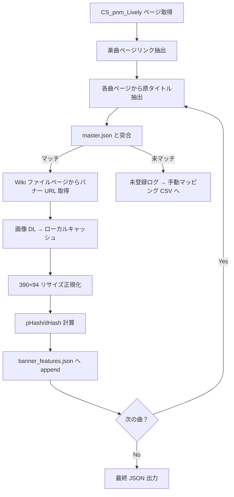
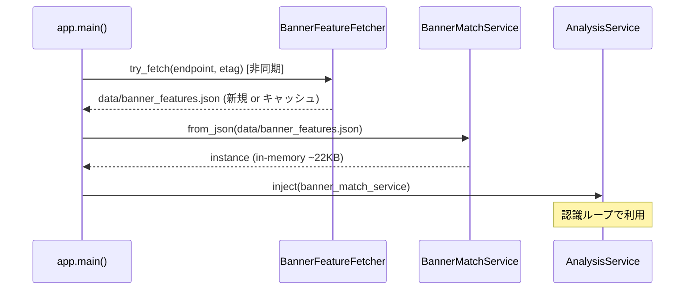

# 詳細設計 - バナー画像認識（v2.0）

| 項目 | 内容 |
|------|------|
| プロダクト名 | LivelyRec |
| 文書 No. | 11 |
| 版数 | 0.1 |
| 作成日 | 2026-05-29 |
| 関連資料 | 要件定義書 v0.7 §3.8、基本設計書 v0.5 §4.5.2／§9.11、PoC #04 v0.3（`docs/design/poc/04_banner_recognition.md`）、詳細設計_画像認識（`10_詳細設計_画像認識.md`） |

## 1. 目的とスコープ

`pop'n music lively` のバナー画像から計算した特徴量を、楽曲特定の **2 次認識器** として利用するサブシステムの詳細設計を規定する。

スコープ:
- 特徴量データのスキーマ・配布方式
- 収集パイプライン（`scripts/build_banner_master.py`）
- ランタイム側マッチングサービス（`BannerMatchService`）
- SELECT / RESULT 画面認識への組込み
- 失敗時の挙動・しきい値設計
- UI 連携（同意ダイアログ、About 出典表示、オプトアウト）

スコープ外（別文書）:
- 楽曲マスタの拡張仕様（`master.json` の `genre` / `alt_titles[]`）は `A-2 残課題` として `scripts/build_master.py` 側の改修。本書では呼び出し前提のみ規定。

## 2. データ構造

### 2.1. `data/banner_features.json` スキーマ

```json
{
  "version": "2026-05-29T00:00:00Z",
  "source": "https://github.com/OWNER/lively-/releases/tag/banner-features-2026-05-29",
  "schema_version": 1,
  "target_size": [390, 94],
  "songs": [
    {
      "song_id": "popn-65f377d055",
      "phash": "0xfedcba9876543210",
      "dhash": "0x123456789abcdef0",
      "src": ["remywiki:File:BN_Foo.png", "fandom:File:Foo_banner.png"]
    }
  ]
}
```

- `phash` / `dhash`: **64bit 整数を 16 桁ゼロパディングの 16 進文字列**で表現。JSON 数値は IEEE754 53bit までしか保証されないため、ビット欠落を避けるため文字列化。
- `src`: 出典 URL の配列。1 曲複数バナーがある場合は代表 1 個のハッシュを採用し、出典は全て記録（再構築時のトレーサビリティ確保）。
- `schema_version`: 将来の拡張に備え。初版は 1。

### 2.2. ランタイム表現

`application/banner_match_service.py`:

```python
@dataclass(frozen=True)
class BannerFeature:
    song_id: str
    phash: int  # 64bit
    dhash: int  # 64bit
    src: tuple[str, ...]

@dataclass(frozen=True)
class BannerMatchResult:
    song_id: str
    distance: int  # pHash 距離 + dHash 距離（0〜128）
    confidence: float  # 0.0〜1.0、distance から算出
    accepted: bool  # accept_threshold 判定
```

## 3. 特徴量計算

PoC #04 §4.2 の実装をベースに、本実装で `infrastructure/banner_features.py` として独立モジュール化。

### 3.1. 前処理

```
入力: frame_bgr (任意サイズ、BGR)
1. 指定 ROI で切り出し
2. cv2.resize(roi, (390, 94), interpolation=INTER_AREA)
3. cv2.cvtColor(resized, COLOR_BGR2GRAY)
出力: gray (94, 390) uint8
```

### 3.2. pHash 64bit (DCT)

```python
def phash64(gray: np.ndarray) -> int:
    small = cv2.resize(gray, (32, 32), interpolation=cv2.INTER_AREA)
    dct = cv2.dct(np.float32(small))
    block = dct[:8, :8].flatten()
    median = np.median(block[1:])  # DC 成分を除外
    bits = (block > median).astype(np.uint8)
    h = 0
    for b in bits:
        h = (h << 1) | int(b)
    return h
```

### 3.3. dHash 64bit

```python
def dhash64(gray: np.ndarray) -> int:
    small = cv2.resize(gray, (9, 8), interpolation=cv2.INTER_AREA)
    diff = (small[:, 1:] > small[:, :-1]).flatten()
    h = 0
    for b in diff:
        h = (h << 1) | int(b)
    return h
```

### 3.4. ハミング距離

```python
def hamming(a: int, b: int) -> int:
    return (a ^ b).bit_count()  # Python 3.10+
```

## 4. 収集パイプライン（`scripts/build_banner_master.py`）

### 4.1. 全体フロー



### 4.2. 楽曲ページ抽出

- 起点: `CS_pnm_Lively` ページ
- API: `action=query&prop=links&pllimit=500`（continue 対応）
- 除外パターン（PoC スクリプトと共通）: `AC pnm`, `CS pnm`, `Pop'n music`, `Category:`, `File:`, `Template:`, `Help:`, `User:`, `MediaWiki:` の各プレフィックス + 既知メタタイトル
- フォールバック: `popnmusic.fandom.com` も `Category:Pop'n_music_lively_Songs` 等（実在性は本実装で要確認）から同様に抽出

### 4.3. 原タイトル抽出

remywiki のページ名はローマ字読みのため、各曲ページ本文から原タイトル（Japanese title）を抽出する。

#### 4.3.1. 抽出方式（優先順）

1. **MediaWiki API `action=parse&prop=wikitext`** で本文 wikitext を取得
2. 本文先頭の Infobox（テンプレート）から `|title=` / `|japanese_title=` / `|jp_title=` 等のパラメータを正規表現で抽出
3. 取れなければ本文先頭の太字部分（`'''<原タイトル>'''`）を抽出
4. それでも取れなければページ名（ローマ字読み）を採用し、`master.json` の `alt_titles[]` での突合に委ねる

#### 4.3.2. master.json との突合

```
入力: 原タイトル候補集合 candidates = {japanese_title, romaji_pagename, infobox_genre}
1. master.json の各曲について以下のフィールドを照合対象とする:
   - title（公式表記）
   - title_norm（正規化済）
   - genre（lively のジャンル名、A-2 残課題で整備）
   - alt_titles[]（別名、A-2 残課題で整備）
2. rapidfuzz WRatio で全候補の最大スコアを採る
3. accept score ≥ 95: 確定
4. 90 ≤ score < 95: 警告ログ + 手動マッピング CSV へ追加候補として出力
5. < 90: 未マッチ。出力 CSV に「未突合」として記録
```

### 4.4. レート制御・キャッシュ

- リクエスト間隔: 既定 1.0 秒（`--rate-sec` で調整可、最小 0.5）
- User-Agent: `LivelyRec/<version> (banner-master builder; +<contact url>)`
- ローカルキャッシュ: `livelyrec_data/banners_ref/<site>/<filename>` に画像本体保存。再実行時は既存ファイル優先（再 DL なし）
- `_index.json` を `<site>/` 直下に置き、`{title, url, fetched_at, sha256}` を記録（差分検出用）

### 4.5. 出力

- `data/banner_features.json`: 確定エントリのみ
- `data/banner_features.unmatched.csv`: 未マッチ・手動マッピング待ちのリスト（コミットしない、ユーザ運用）
- 実行ログ: `livelyrec_data/logs/build_banner_master.log`

## 5. ランタイムサービス

### 5.1. クラス構成

```
application/
  banner_match_service.py       # メイン: load / identify
infrastructure/
  banner_features.py            # phash64 / dhash64 / hamming
  banner_fetcher.py             # data/banner_features.json の取得（GitHub Releases / ローカル）
  banner_image_fetcher.py       # ユーザ操作で Wiki から画像本体を取得（FR-BAN-006）
```

### 5.2. `BannerMatchService` インタフェース

```python
class BannerMatchService:
    def __init__(
        self,
        features: list[BannerFeature],
        accept_threshold: int = 20,      # 0..128, 詳細設計確定
        candidate_threshold: int = 40,   # 0..128
        target_size: tuple[int, int] = (390, 94),
    ) -> None: ...

    @classmethod
    def from_json(cls, path: Path) -> "BannerMatchService": ...

    def identify(
        self,
        frame_bgr: np.ndarray,
        roi: tuple[int, int, int, int],
        primary_candidates: list[str] | None = None,
    ) -> BannerMatchResult | None: ...

    def reload(self, path: Path) -> int: ...
```

- `primary_candidates`: 1 次認識器の Top-K 楽曲 ID リスト。`accept_threshold < distance ≤ candidate_threshold` のとき、両者の共通候補があれば確定する用途。
- `reload`: 起動後の `banner_features.json` 更新（手動更新ボタン）に対応。

### 5.3. しきい値設計

PoC #04 §7.6 の実測（正解未含有時の Top-1 ハミング距離 22〜30 / 64bit）を出発点に、pHash+dHash 合算（0〜128）で再キャリブレーション。

| 状況 | distance (合算 128bit 中) | 動作 |
|------|---------------------------|------|
| 確定 | 0 ≤ d ≤ 20 | `accepted=True`, 直ちに 2 次認識器単独で確定 |
| 突合候補 | 20 < d ≤ 40 | `accepted=False`, 1 次認識器の Top-K と突合し共通候補があれば確定 |
| 未特定 | d > 40 | `accepted=False`, 「未特定」を返し 1 次認識器に委譲 |

数値は本実装フェーズで正解付き測定（lively 実バナー収集後）により再決定する。判定値は `application/banner_match_service.py` の定数として宣言し、テストで境界値検証する。

### 5.4. 起動シーケンス



- BannerFeatureFetcher の失敗時は WARN ログのみで起動継続（FR-BAN-001 末文）。
- 初回起動時に `data/banner_features.json` が無ければ、リポジトリ同梱の seed JSON にフォールバック。

## 6. 認識器への組込み

### 6.1. RESULT 画面（`infrastructure/recognizer/result_screen.py`）

既存の楽曲特定ロジックに 2 次認識器を組み込む。

```python
def identify_song_on_result(
    frame_bgr: np.ndarray,
    cached_song_id: str | None,
    cached_confidence: float,
    banner_service: BannerMatchService | None,
) -> IdentifyResult:
    # 1. 既存: プレイ画面キャッシュ優先
    if cached_song_id and cached_confidence >= PRIMARY_TRUST_THRESHOLD:
        return IdentifyResult(cached_song_id, cached_confidence, source="cache")

    # 2. v2.0: バナー特徴量マッチ
    if banner_service is not None:
        result = banner_service.identify(
            frame_bgr=frame_bgr,
            roi=RESULT_ROI["banner"],
            primary_candidates=[cached_song_id] if cached_song_id else None,
        )
        if result and result.accepted:
            return IdentifyResult(result.song_id, result.confidence, source="banner")

    # 3. 既存ロジック（直近キャッシュ採用 or 未特定）
    if cached_song_id:
        return IdentifyResult(cached_song_id, cached_confidence, source="cache_low_conf")
    return IdentifyResult(None, 0.0, source="unidentified")
```

### 6.2. SELECT 画面（`infrastructure/recognizer/select_screen.py`）

v1.x ではプレースホルダ実装（R-027）。v2.0 で本実装。

```python
def identify_song_on_select(
    frame_bgr: np.ndarray,
    banner_service: BannerMatchService | None,
    stabilizer: SongStabilizer,
) -> str | None:
    if banner_service is None:
        return None  # v2.0 前の挙動を維持
    result = banner_service.identify(
        frame_bgr=frame_bgr,
        roi=READY_ROI["song_banner"],  # SELECT でも同 ROI を使用（要 PoC 再確認）
    )
    if result and result.accepted:
        # 連続フレームの多数決で安定化
        stable_id = stabilizer.feed(result.song_id)
        return stable_id
    return None
```

- ROI は `READY_ROI["song_banner"]` (560, 130, 980, 220) を初期採用し、本実装フェーズの実機サンプルで再確認。
- SELECT 画面では曲送り頻度が高いため、`SongStabilizer` で 3 連続一致を要件とする（既存実装と同パターン）。
- ブラウザソース「選曲中の楽曲スコア履歴」（R-027）を SELECT 検出の到来で正規化。

## 7. UI 連携

### 7.1. 同意ダイアログ（FR-BAN-006）

初回「Wiki からバナー画像を取得」ボタン押下時に表示:

```
┌──────────────────────────────────────────────────┐
│ バナー画像の取得について                          │
├──────────────────────────────────────────────────┤
│ 以下のサイトからバナー画像をダウンロードし、     │
│ お使いの PC のローカルフォルダに保存します。     │
│                                                  │
│ ・remywiki.com                                   │
│ ・popnmusic.fandom.com                           │
│                                                  │
│ 取得した画像は楽曲認識の精度向上のみに用い、     │
│ アプリで再配布することはありません。             │
│                                                  │
│ 本機能のご利用は私的複製の範囲内で、お客様の     │
│ 責任で行ってください。本アプリは KONAMI 公式と   │
│ は無関係です。                                   │
│                                                  │
│ ☐ 次回から表示しない                             │
│                                                  │
│         [同意して取得開始]   [キャンセル]        │
└──────────────────────────────────────────────────┘
```

- 同意は `app_kv` テーブル（既存）に `banner_fetch_consent=YYYY-MM-DD` として保存。
- 「次回から表示しない」未チェック時は毎回表示、チェック時は同意済記録で省略。
- キャンセル時は何も取得せず、同意も保存しない。

### 7.2. About 欄出典・免責表示（FR-BAN-008）

設定ダイアログの About タブまたはメニュー「ヘルプ → このアプリについて」に追記:

```
バナー画像参照: remywiki.com, popnmusic.fandom.com
（各サイトの著作権・利用規約はそれぞれのサイトをご参照ください）

本アプリは個人開発の非営利ツールであり、
株式会社コナミデジタルエンタテインメントとは無関係です。
"pop'n music" および "lively" は同社の登録商標です。
```

### 7.3. オプトアウト設定（FR-BAN-009）

設定ダイアログの「楽曲認識」タブに追加:

| 項目 | 既定 | 説明 |
|------|------|------|
| バナー特徴量マッチを使用する | ON | OFF 時は 1 次認識器（OCR）のみ |
| Wiki から自動でバナー画像を取得する | OFF | ON 時に「Wiki から取得」ボタンが有効化 |
| バナー画像保存先 | `livelyrec_data/banners_ref/` | パス変更可 |

設定キー: `banner.match_enabled`, `banner.auto_fetch_enabled`, `banner.cache_dir`。

## 8. エラーハンドリング

| 事象 | 動作 | ログレベル |
|------|------|-----------|
| `banner_features.json` 取得失敗（ネットワークエラー） | seed JSON にフォールバック、本機能は seed のまま稼働 | WARN |
| `banner_features.json` パースエラー | 2 次認識器を無効化（`banner_service=None`）、1 次認識器のみで継続 | ERROR |
| ROI が範囲外（解像度不一致） | 当該フレームの 2 次認識をスキップ、1 次認識器へ委譲 | WARN（初回のみ） |
| pHash 計算で例外（unreachable） | スキップ＋スタックトレース、本体動作継続 | ERROR |
| Wiki 画像取得時の HTTP エラー | リトライ最大 2 回、それでも失敗なら該当ファイルだけスキップ | WARN |
| ローカルキャッシュ書込失敗（容量不足等） | NFR-OPS-006 警告と同パターン、本機能スキップ | WARN |

## 9. テスト方針

### 9.1. 単体テスト

| テスト | 内容 |
|--------|------|
| `test_banner_features.py` | pHash/dHash の決定論性（同一入力→同一出力）、ハミング距離の対称性 |
| `test_banner_match_service.py` | `identify()` のしきい値境界（19/20/21、39/40/41）、primary_candidates 突合、空マスタ時の None 返却 |
| `test_banner_fetcher.py` | ETag 差分取得、ネットワーク失敗時の seed フォールバック |
| `test_banner_features_schema.py` | JSON スキーマ妥当性、16進文字列 ↔ int64 ラウンドトリップ |

### 9.2. 結合テスト

| テスト | 内容 |
|--------|------|
| `IT-BAN-01` | RESULT サンプル（既存 `tests/fixtures/sample/リザルト画面/`）に対し、模擬 `banner_features.json` で 2 次認識器が動作することを確認 |
| `IT-BAN-02` | SELECT サンプル（既存 `tests/fixtures/sample/選曲画面/`）に対し、同様に動作確認 |
| `IT-BAN-03` | `banner_features.json` 取得失敗時に 1 次認識器のみで `RecordingService` が完走することを確認 |

### 9.3. システムテスト

- 本実装後に lively 実プレイ録画から正解付き測定セットを構築し、Top-1 精度 ≥ 90% を確認。
- 区分 A: 机上判定（テスト計画書側で別途定義）。
- 区分 B: PO 実機実施。

## 10. 性能・スレッド設計

- 認識ループ呼び出し: 既存 `recording_service` の認識ワーカ（`QThreadPool`、単一実行）からシーケンシャル呼び出し。
- 1 枚あたり期待値: < 1ms（PoC 実測）、上限予算 30ms（NFR-PERF-BAN-001）。
- メモリ占有: 約 22KB（1347 件 × `BannerFeature` ~16 bytes 相当）。
- ロード時間: 初回 `from_json()` で < 50ms（1347 件想定）を許容。

## 11. マイグレーション・互換性

- v1.x → v2.0 でアプリ起動時:
  - `data/banner_features.json` が無い場合（既存ユーザの初回 v2.0 起動）は同梱 seed を採用。
  - 設定 `banner.match_enabled` 未存在時は ON（既定）にフォールバック。
  - 設定 `banner.auto_fetch_enabled` 未存在時は OFF（既定）にフォールバック。
- SQLite スキーマ変更なし、`schema_version` 据え置き（v2 のまま）。

## 12. 用語

- **特徴量**: 画像から計算したハッシュ値（pHash / dHash）の総称
- **1 次認識器**: 既存の OCR + ファジーマッチによる楽曲特定
- **2 次認識器**: 本書で規定するバナー特徴量マッチによる楽曲特定
- **seed JSON**: アプリ配布物に同梱する初期 `banner_features.json`
- **ローカルキャッシュ**: ユーザ PC の `livelyrec_data/banners_ref/` 配下に保存される画像本体

## 13. 未確定事項

| # | 項目 | 確定時期 |
|---|------|---------|
| 13.1 | `accept_threshold` / `candidate_threshold` の最終値 | 本実装フェーズで正解付き測定後 |
| 13.2 | SELECT 画面 ROI `READY_ROI["song_banner"]` のカーソル中央追従の必要性 | 本実装の SELECT 画面 PoC 再確認後 |
| 13.3 | `master.json` への `genre` / `alt_titles[]` 追加スキーマ | A-2 残課題と統合（別文書） |
| 13.4 | 1 曲複数バナー（カバー版・アレンジ違い）の扱い | 実データで重複頻度を見て判断 |
| 13.5 | コミュニティ共有による特徴量データ補完（v2.x） | v2.x 計画時 |

## 14. 改訂履歴

| 版 | 日付 | 内容 | 改訂者 |
|----|------|------|--------|
| 0.1 | 2026-05-29 | 初版作成（要件定義書 v0.7 / 基本設計書 v0.5 / リスク管理表 v2.1 / PoC #04 v0.3 を入力に作成） | Claude Code |
