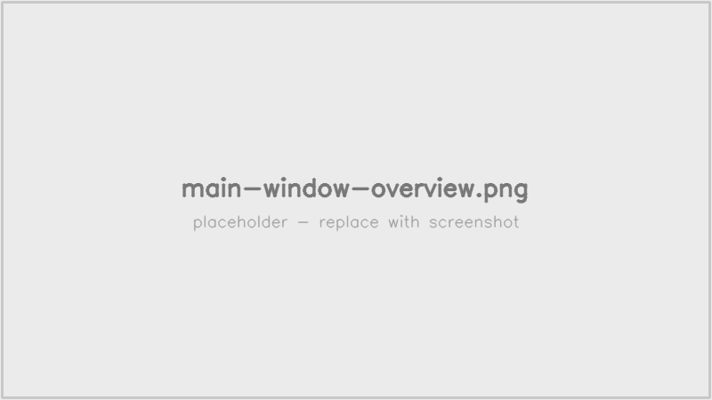

# LivelyRec

**トップ** ｜ [インストール](installation.html) ｜ [使い方](usage.html) ｜ [配信支援オーバーレイ](broadcast.html)

**pop'n music lively** のゲーム画面を OBS WebSocket 経由で取得し、画像認識でスコアを自動記録 + OBS ブラウザソース向けの配信支援オーバーレイを提供する、スタンドアロン **Windows アプリ**です。

[GitHub リポジトリ](https://github.com/Freedom645/livelyrec){:target="_blank"}
｜ [Releases](https://github.com/Freedom645/livelyrec/releases){:target="_blank"}

*メイン画面。記録開始・現在状態・直近リザルト・打鍵数カウンタを一画面で確認できます。*

---

## 主な機能

- OBS WebSocket からゲーム画面を取得し、画像認識で **スコア・楽曲・難易度** を自動判定
- リザルト画面で **スコアを自動記録**（SQLite 保存 + CSV 出力）
- **楽曲認識の補助** — 楽曲名 OCR が難しい場面でバナー特徴量による 2 次認識を併用
- **OBS ブラウザソース向けオーバーレイ** — 打鍵数・直近リザルト・楽曲情報をライブ表示
- **プレイ日**（午前 ◯ 時切替）単位の打鍵数集計
- スタンドアロン portable 構成（`livelyrec_data/` にすべてのユーザデータを集約）

## ドキュメント

| ページ | 内容 |
|--------|------|
| [インストール](installation.html) | ダウンロードと初回起動 |
| [使い方](usage.html) | 設定・記録開始・スコア確認・CSV 出力 |
| [配信支援オーバーレイ](broadcast.html) | OBS ブラウザソースの設定（同一PC / LAN 別PC） |

## 動作環境

- **Windows 10 (21H2 以降) 64bit、または Windows 11**
- **OBS Studio 28 以降**（WebSocket v5 対応版）
- pop'n music lively がインストールされ、OBS でキャプチャできること

## ライセンス

[MIT License](https://github.com/Freedom645/livelyrec/blob/main/LICENSE){:target="_blank"}
