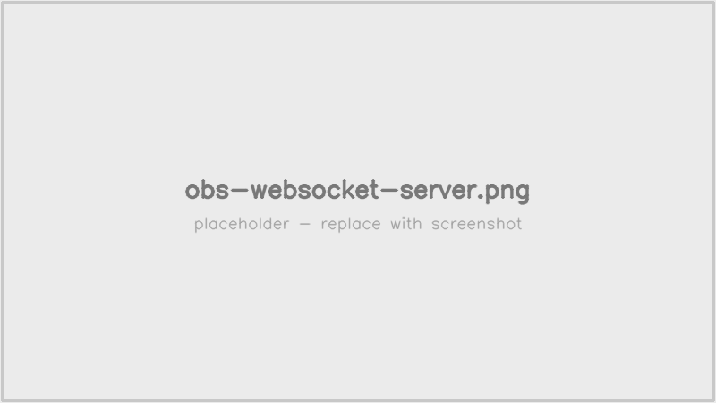
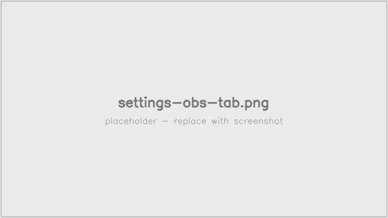
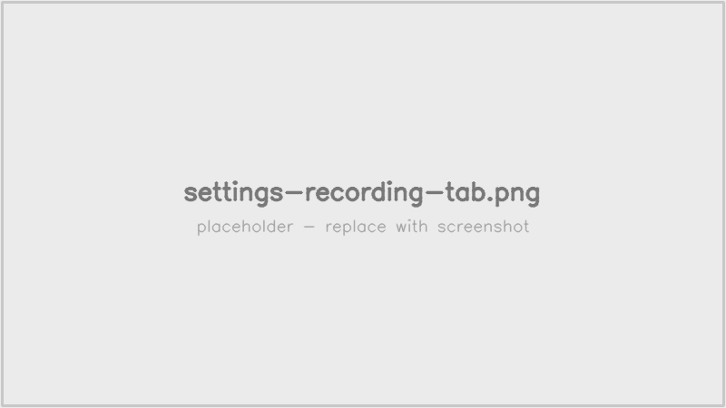
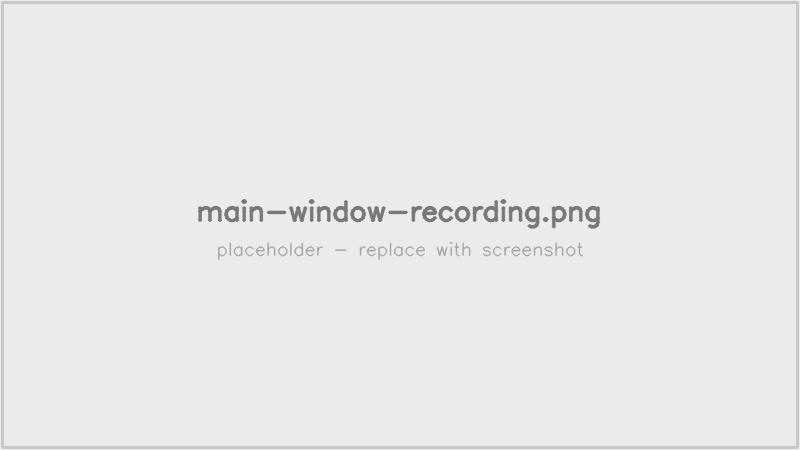
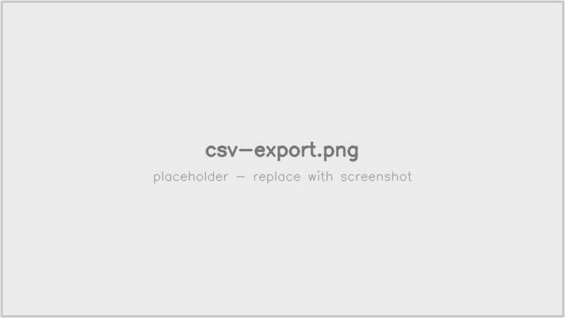

# 使い方

[トップ](./) ｜ [インストール](installation.html) ｜ **使い方** ｜ [配信支援オーバーレイ](broadcast.html)

## 事前準備（OBS 側）

1. OBS Studio で pop'n music lively のキャプチャソースを作成
   - ウィンドウキャプチャ／ゲームキャプチャ／ディスプレイキャプチャいずれでも可
   - 解像度 **1366×768** を推奨（ROI のキャリブレーション基準）
2. OBS の「ツール」→「WebSocket サーバ設定」を開く
3. 「WebSocket サーバを有効化」にチェック
4. ポートは既定の `4455` のまま、パスワードを設定してメモしておく

*OBS「ツール」→「WebSocket サーバ設定」。サーバを有効化し、ポートとパスワードを控えます。*

## アプリの初期設定

LivelyRec を起動し、画面右上「**設定**」ボタンを押して、各タブを設定します。最低限「OBS」タブを設定すればスコア記録を開始できます。

### OBS タブ

OBS への接続情報を設定します。スコア記録に必須です。

| 項目 | 内容 |
|------|------|
| ホスト | OBS が動いているPCの IP。同一PC なら `127.0.0.1` |
| ポート | OBS の WebSocket ポート（既定 `4455`） |
| ソース名 | キャプチャソースの名前。「**OBSから取得**」ボタンで OBS の入力ソース一覧から選択可能 |
| パスワード | OBS WebSocket のパスワード |
| パスワードを保存する | OFF にすると毎起動時に入力を求めます |

*OBS タブ。「OBSから取得」でソース一覧を取り込めます。*

> **平文保存の注意**: 設定は `livelyrec_data/settings.json` に平文で保存されます。サポート用に共有する際はパスワードを削除してから送付してください（UI 上部に警告バー表示）。

### 記録タブ

| 項目 | 内容 |
|------|------|
| fps | OBS からの取得頻度。既定 `2`（0.5 秒間隔で認識・配信表示とも十分） |
| プレイ日切替時刻 | 集計上の「1日」の境目。既定 `6`（午前 6 時で日付切替） |
| デバッグ撮影 | 取得フレームを `livelyrec_data/debug/` に保存。不具合報告時のみ ON |
| リザルト自動スクショ | リザルト画面を自動で画像保存（保存先・空き容量を表示） |

*記録タブ。取得頻度・プレイ日の切替時刻などを設定します。*

### WebSocket タブ

配信支援オーバーレイ用の WebSocket サーバ設定（ホスト・ポート・LAN公開・外部連携URI）。詳細は [配信支援オーバーレイ](broadcast.html) を参照。

### 配信支援タブ

オーバーレイのテーマ CSS URL を指定できます。詳細は [配信支援オーバーレイ](broadcast.html) の「テーマのカスタマイズ」を参照。

### アップデートタブ

| 項目 | 内容 |
|------|------|
| 自動アップデート | 新バージョンを自動で取得 |
| 起動時にアップデート確認 | 起動時に Releases を確認 |

### マスタタブ

楽曲マスタ（曲名・難易度の対応データ）の配信元 URL を指定します。通常は同梱データで動作するため変更不要です。

### 楽曲認識タブ

リザルト画面の楽曲名 OCR が難しい場合に、バナー画像の**特徴量ハッシュ値**で楽曲を補助的に特定する機能です。アプリは特徴量ハッシュ値のみを扱い、バナー画像本体は配布物にもユーザ PC にも保存しません。

| 項目 | 内容 |
|------|------|
| バナー特徴量マッチを使用する | 楽曲認識の補助を有効化（既定 ON） |
| 特徴量配信URL | 特徴量データの配信元。通常は同梱の `banner_features.json` を使用 |

## 記録の開始

設定保存後、メイン画面の「**記録開始**」を押すと OBS に接続し、ゲーム画面の取得・認識が始まります。

*記録中のメイン画面。現在状態・直近リザルト・打鍵数カウンタがリアルタイムに更新されます。*

### 動作の流れ

1. **タイトル / 選曲 / 準備 画面**: アプリは画面種別を判定するだけで、特に記録なし
2. **プレイ画面**: 楽曲・難易度を識別。「現在状態」パネルに楽曲・難易度が表示される
3. **リザルト画面**: スコア・コンボ・判定数を自動取得、SQLite に保存。「直近リザルト」パネルに表示される
4. **打鍵数カウンタ**: リザルト確定ごとに、当日のプレイ日カウンタへ加算

### CSV 出力

メイン画面の「**CSV 出力**」（または記録メニュー）から、当日／指定日の記録を CSV ファイルへ書き出せます。文字コードは **UTF-8 with BOM**（Excel 直開きで文字化けしない既定）。

*CSV 出力。対象日を指定して書き出せます。*

## トラブルシュート

| 症状 | 対処 |
|------|------|
| OBS に接続できない | OBS が起動しているか、WebSocket が有効か、ホスト・ポート・パスワードが正しいか確認 |
| 楽曲が認識されない | キャプチャ解像度が 1366×768 になっているか確認。それでも改善しない場合はデバッグ撮影 ON にして再現させ、`livelyrec_data/debug/` の画像を [Issue](https://github.com/Freedom645/livelyrec/issues){:target="_blank"} に添付 |
| スコアが 1 件前の楽曲で記録される | 既知の不具合として修正済み。最新版で再現する場合は Issue で報告 |
| ログを見たい | `livelyrec_data/logs/livelyrec.log` |

## ファイルの場所

すべて portable 構成で、アプリと同じフォルダの `livelyrec_data/` に集約されています:

| パス | 内容 |
|------|------|
| `livelyrec_data/settings.json` | 設定（OBS 接続情報・WebSocket・各種オプション） |
| `livelyrec_data/db/livelyrec.sqlite` | スコア・プレイ履歴 |
| `livelyrec_data/export/*.csv` | CSV 出力 |
| `livelyrec_data/logs/livelyrec.log*` | ログ（日次ローテーション） |
